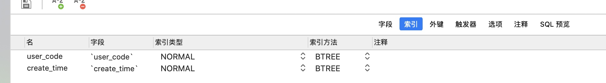
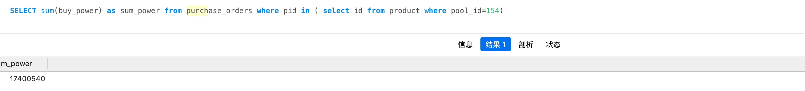
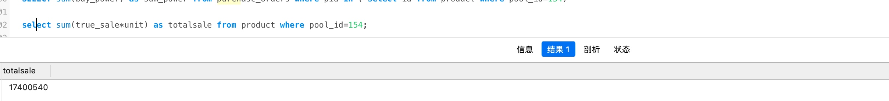
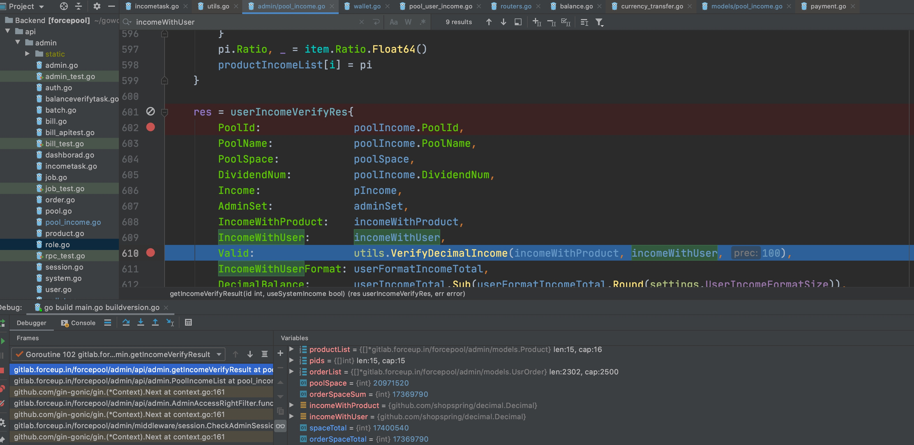
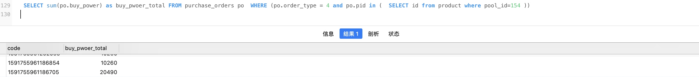
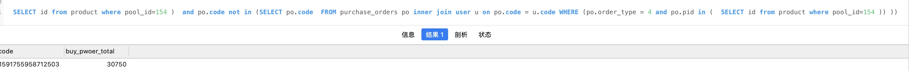

 [TOC]

### 没有建立索引 导致数据量大时， 查询变慢
建立索引：

ALTER TABLE user_notify ADD INDEX (create_time);

ALTER TABLE user_notify ADD INDEX (user_code);


 
### 引起用户本期收益校验不过的问题 

用户本期收益1， 为矿池产品收益表计算出
用户本期收益2， 为购买订单表计算出

相应代码：


一个矿池下所有产品的收入：


#### 每个产品都有这个产品下的所有订单：


####  产品收益 = 产品空间* 单位产品收益

pinc := pIncomePerUnit.Mul(decimal.NewFromInt(int64(productSpace)))
表示： 产品收益 = 产品空间* 单位产品收益

orderSpace := getOrderSpace(prodOrders) 
表示： 获取该产品下的所有订单的总空间大小


#### 获取用户的所有收益， 和本期收益


所有收入为： 530119 -3 = 530.119
本期收入为： 9900 0000 0000 0000 -16 = 0.99 

truancate表示截取小数点后指定位数。 


#### 产品收益数据


```
pi = {*gitlab.forceup.in/forcepool/admin/api/admin.productIncome | 0xc000297200} 
 ProductId = {int} 360
 ProductName = {string} "0609产品1号"
 ProductSpace = {int} 2181120
 Ratio = {float64} 1
 Fee = {github.com/shopspring/decimal.Decimal} 
  value = {*math/big.Int | 0xc0005fc360} 
   neg = {bool} false
   abs = {math/big.nat} len:2, cap:6
    0 = {math/big.Word} 8594261699777789952
    1 = {math/big.Word} 29308100705328
  exp = {int32} -32
 Income = {github.com/shopspring/decimal.Decimal} 
  value = {*math/big.Int | 0xc0005fc180} 
   neg = {bool} false
   abs = {math/big.nat} len:1, cap:6
    0 = {math/big.Word} 540 6390 3299 7700 6080   
    // 表示产品本期收益 540.639 
  exp = {int32} -16
 ProductIncome = {github.com/shopspring/decimal.Decimal} 
  value = {*math/big.Int | 0xc0005fc240} 
   neg = {bool} false
   abs = {math/big.nat} len:2, cap:6
    0 = {math/big.Word} 2281680887361830912
    1 = {math/big.Word} 2901501969827518
  exp = {int32} -32
 UserIncome = {github.com/shopspring/decimal.Decimal} 
  value = {*math/big.Int | 0xc0005b2580} 
   neg = {bool} false
   abs = {math/big.nat} len:2, cap:7
    0 = {math/big.Word} 1404924447810387968
    1 = {math/big.Word} 2887879894851802
    // 表示用户本期收益为 532.7198
  exp = {int32} -32
 UserIncomePerUnit = {github.com/shopspring/decimal.Decimal} 
  value = {*math/big.Int | 0xc0005b27e0} 
   neg = {bool} false
   abs = {math/big.nat} len:1, cap:6
    0 = {math/big.Word} 2524 6822 7673 4976
    //。每个空间单位的收益为 0.252468 
  exp = {int32} -16
```


　　无上正遍知觉。普应机宜。说法三百余会。皆令群有同证真常。求其机宜相感。生佛缘深。至简至易而功高径捷者。无越求生净土一门也。首因法藏比丘无量劫前为大国王。闻世自在王佛说法。弃国出家。佛为广说佛刹庄严。即发四八大愿。愿成佛时国无三途．三毒．八苦．八难．九恼．十缠等一切障碍。生者皆住正定。乃至十念得生。若不尔者不取正觉。时地动雨华。空乐自鸣。佛与其记。从是多劫依愿修行。今已成佛十劫。功德．神通．光明．力．无畏等超过十方佛。号阿弥陀。国从娑婆西过十万亿土。名曰极乐。以大愿神力说法。摄取十方念佛众生。得不退转。刹那尚莫胜数。何况历劫生者有何限极。微尘所不能喻。国土庄严亦超十方。诸池皆七宝成。有大池其量盈广。正住其中。底布金沙。边铺阶道。上有楼阁千层万叠。广博妙好光明赫奕。池内八功德水。香美清彻盈溢充满。为十四支。于无量严具中寻流上下。声演无量法门。水中六十亿七宝莲团圆正等。三辈九品行列次第。香洁微妙映蔽其国。宝地平正。上有七重栏楯行树。宝幢台榭幡盖珠缨。各各无量殊特妙好。周回间列庄严其国。雨诸天衣香花缯乐。缤纷散漫遍虚空界。如是严具。皆金．银．琉璃．毗楞伽．甄叔迦等金刚摩尼如意珠王不思议宝所成。众宝各放无量百千万亿光王互映大千世界。其光交罗不相障碍。


对应产品1号的数据：


#### 问题原因: 购买订单被手动删除了
先看产品表总共卖出的：
select sum(true_sale) as totalsale from product where pool_id=154;


再看订单表的总共买入的：

卖出的和买入的不相等， 导致上面的用户收益校验不过，

原因， 那买入30的订单被手动删除了， 当时为了解决余额校验不过的问题， 转账表和balance表查出的用户余额不对。 

####  解决办法： 手动改购买订单的num， 加上30， 

但还是不对， 虽然从订单中计算的用户收益， 变大了， 离产品计算的用户收益更近了， 但还是不相等， 恰好当初有截图， 按截图加上： 

订单中与计算用户收益有关的是： 


####   购买订单中， 用户买该矿池中的总算力
```
SELECT sum(buy_power) as sum_power from purchase_orders where pid in ( select id from product where pool_id=154)
```


```
select sum(true_sale*unit) as totalsale from product where pool_id=154;
```


两个表查询出的算力相同， 购买订单的用户算力 和 产品的用户算力

再断点调试一下， 看到购买订单的用户算力  小于产品的 用户算力： 

space 差值为 30750， 正好类似两个订单凑到：

 
 购买订单表应为有些用户在用户表找不到了， 导致购买订单表与用户表内连接时， 这些不存在的用户的订单被过滤掉了。 
 如果改为左连接， 此处用户收益校验可以过， 但不合理
 
 
 
#### 找出购买订单中，在用户表里已经不存在的用户的user_code

 ```sql
 SELECT po.code, sum(po.buy_power) as buy_pwoer_total  FROM purchase_orders po left join user u on po.code = u.code WHERE (po.order_type = 4 and po.pid in (  SELECT id from product where pool_id=154 )  and po.code not in (SELECT po.code  FROM purchase_orders po inner join user u on po.code = u.code WHERE (po.order_type = 4 and po.pid in (  SELECT id from product where pool_id=154 )) ))  
 ```
 
 
找到的用户表已不存在的user_code， 这个订单的算力 就是 用户缺少的算力。 导致用户收益校验不过。 

如果不把这个订单找出来， 那么订单的算力，没有任何用户领取， 这个算力就被白白浪费掉。 


不能清理数据， 清数据有时是为了掩盖问题。 


13917387610,

