 [TOC]
### 引起用户本期收益校验不过的问题 


相应代码：
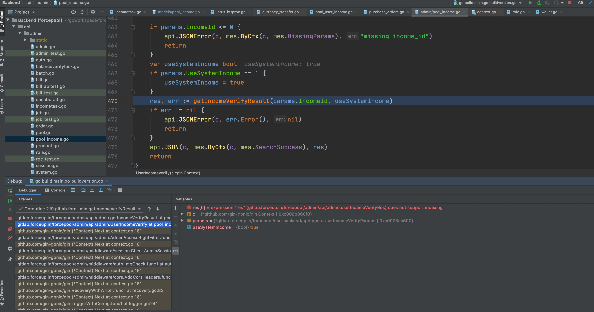


一个矿池下所有产品的收入：
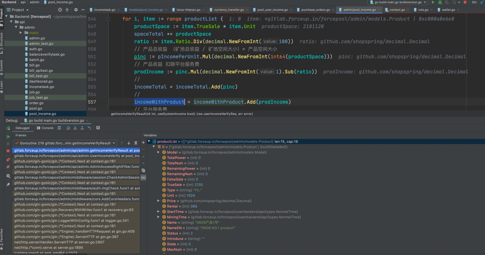

#### 每个产品都有这个产品下的所有订单：
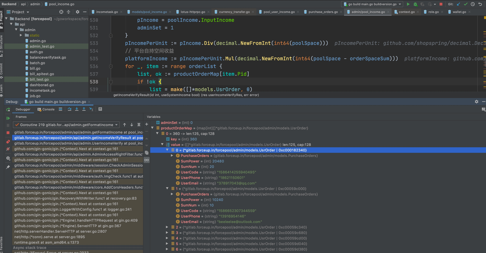


####  产品收益 = 产品空间* 单位产品收益
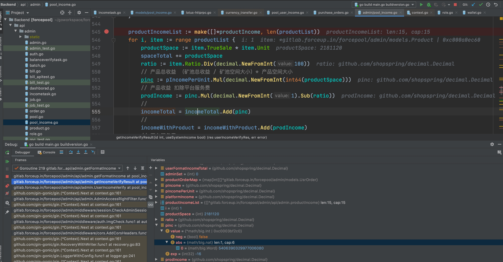
pinc := pIncomePerUnit.Mul(decimal.NewFromInt(int64(productSpace)))
表示： 产品收益 = 产品空间* 单位产品收益

orderSpace := getOrderSpace(prodOrders) 
表示： 获取该产品下的所有订单的总空间大小


#### 获取用户的所有收益， 和本期收益
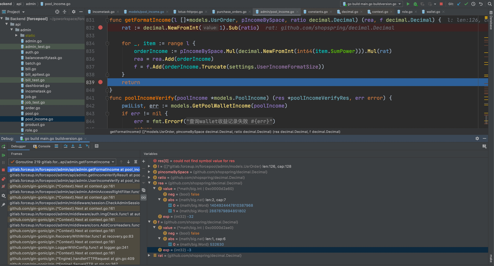

所有收入为： 530119 -3 = 530.119
本期收入为： 9900 0000 0000 0000 -16 = 0.99 
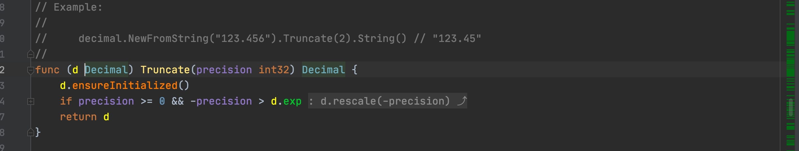
truancate表示截取小数点后指定位数。 

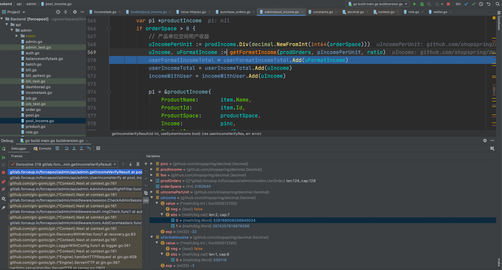

#### 产品收益数据
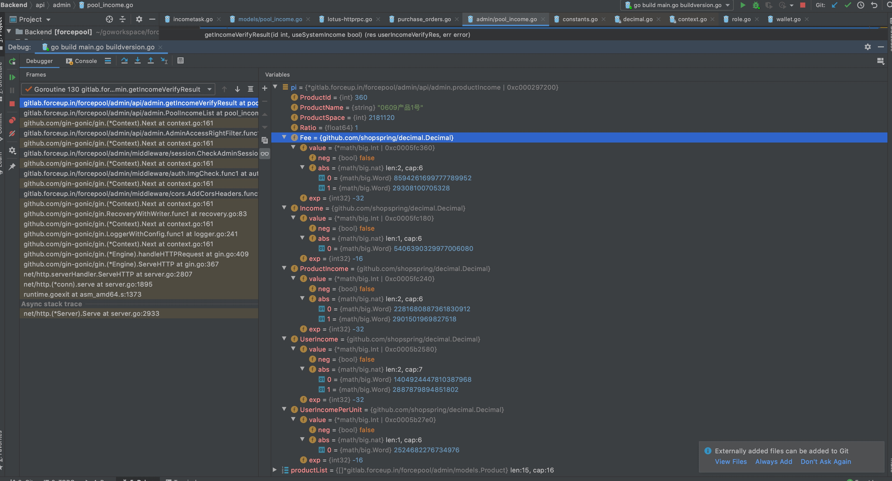


```
pi = {*gitlab.forceup.in/forcepool/admin/api/admin.productIncome | 0xc000297200} 
 ProductId = {int} 360
 ProductName = {string} "0609产品1号"
 ProductSpace = {int} 2181120
 Ratio = {float64} 1
 Fee = {github.com/shopspring/decimal.Decimal} 
  value = {*math/big.Int | 0xc0005fc360} 
   neg = {bool} false
   abs = {math/big.nat} len:2, cap:6
    0 = {math/big.Word} 8594261699777789952
    1 = {math/big.Word} 29308100705328
  exp = {int32} -32
 Income = {github.com/shopspring/decimal.Decimal} 
  value = {*math/big.Int | 0xc0005fc180} 
   neg = {bool} false
   abs = {math/big.nat} len:1, cap:6
    0 = {math/big.Word} 540 6390 3299 7700 6080   
    // 表示产品本期收益 540.639 
  exp = {int32} -16
 ProductIncome = {github.com/shopspring/decimal.Decimal} 
  value = {*math/big.Int | 0xc0005fc240} 
   neg = {bool} false
   abs = {math/big.nat} len:2, cap:6
    0 = {math/big.Word} 2281680887361830912
    1 = {math/big.Word} 2901501969827518
  exp = {int32} -32
 UserIncome = {github.com/shopspring/decimal.Decimal} 
  value = {*math/big.Int | 0xc0005b2580} 
   neg = {bool} false
   abs = {math/big.nat} len:2, cap:7
    0 = {math/big.Word} 1404924447810387968
    1 = {math/big.Word} 2887879894851802
    // 表示用户本期收益为 532.7198
  exp = {int32} -32
 UserIncomePerUnit = {github.com/shopspring/decimal.Decimal} 
  value = {*math/big.Int | 0xc0005b27e0} 
   neg = {bool} false
   abs = {math/big.nat} len:1, cap:6
    0 = {math/big.Word} 2524 6822 7673 4976
    //。每个空间单位的收益为 0.252468 
  exp = {int32} -16
```

对应产品1号的数据：
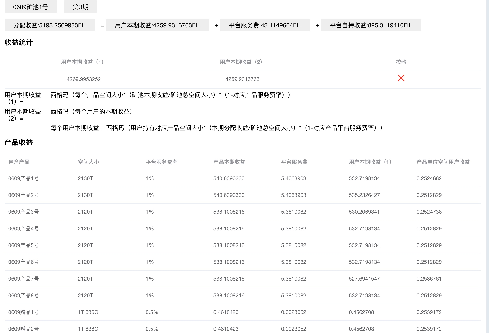


#### 问题原因
先看产品表总共卖出的：
select sum(true_sale) as totalsale from product where pool_id=154;
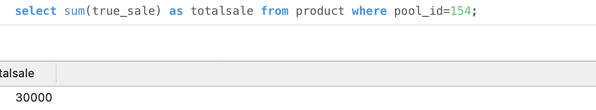

再看订单表的总共买入的：

卖出的和买入的不相等， 导致上面的用户收益校验不过，

原因， 那买入30的订单被误删除了， 
####  解决办法： 手动改购买订单的num， 加上30， 
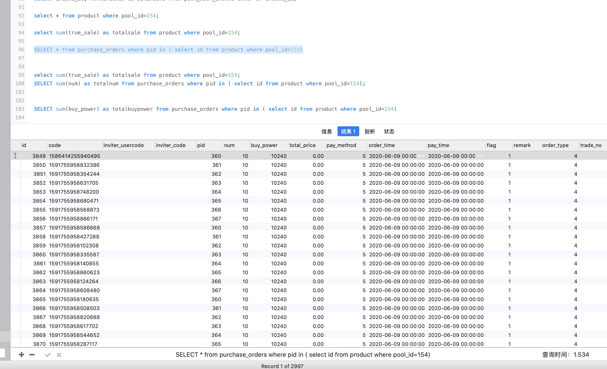
但还是不对， 虽然从订单中计算的用户收益， 变大了， 离产品计算的用户收益更近了， 但还是不相等， 恰好当初有截图， 按截图加上： 
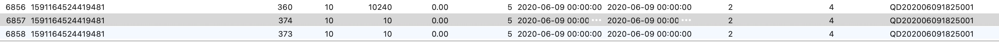
订单中与计算用户收益有关的是： 
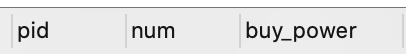
