[TOC]
##  解决账户金额校验不过的问题
问题现象： 
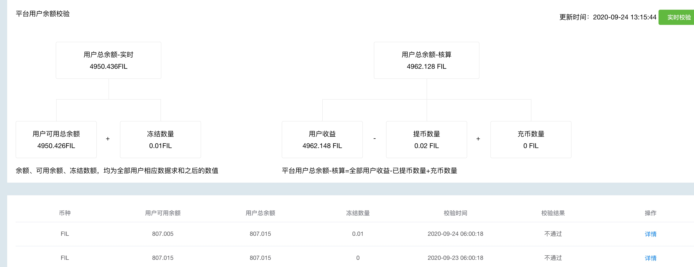

### 先看转账表和balance表的两个表的差额是多少
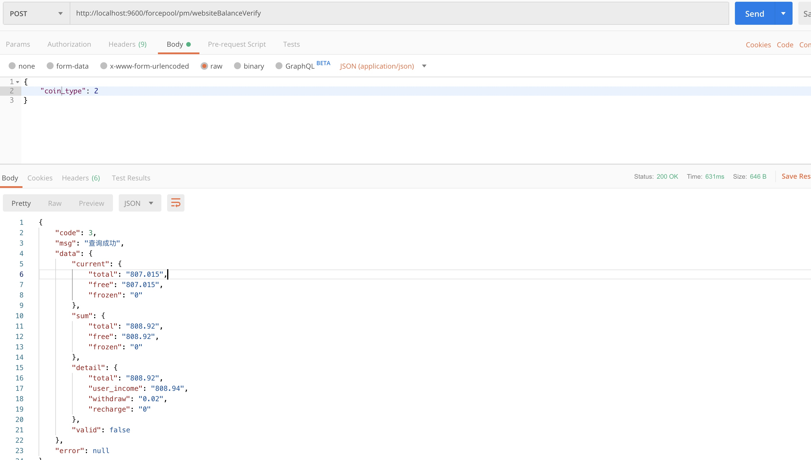
 这里为
 808.94 - 807.015 = 1.905， 
 即转账表currency_transfer 比 资金表balance表 金额多了1.905 fil
 所以从转账表开始查
###  转账表有问题
#### 按code分组查转账表
按code分组， 一个code代表一个用户， 查每个分组的num总和。 
```
SELECT  code, sum(num) as numsum, apply_time, gmt_create, gmt_modified  from currency_transfer GROUP BY code 
```
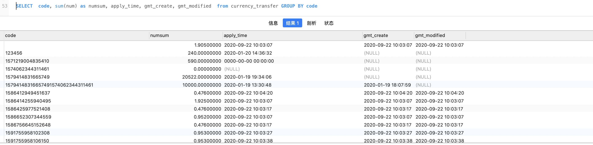

SELECT  code, sum(num) as numsum, apply_time, gmt_create, gmt_modified  from currency_transfer GROUP BY code 

找到code 为空， 但金额却为1.905fil 的， 查code如何产生的。 
code为空， 导致 currency_transfer 有转账记录， 而balance表没有记录。 

#### 把分组展开，看下code 为空的数据， 即产生问题数据的代码
```
SELECT * from currency_transfer where code=''
```
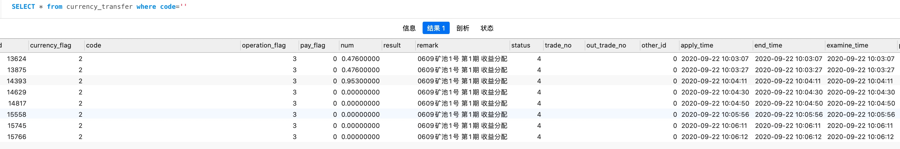
对应的代码：
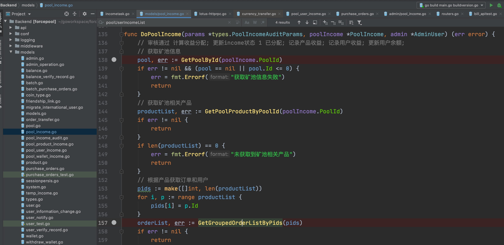

下面往currency_transfer表里写数据
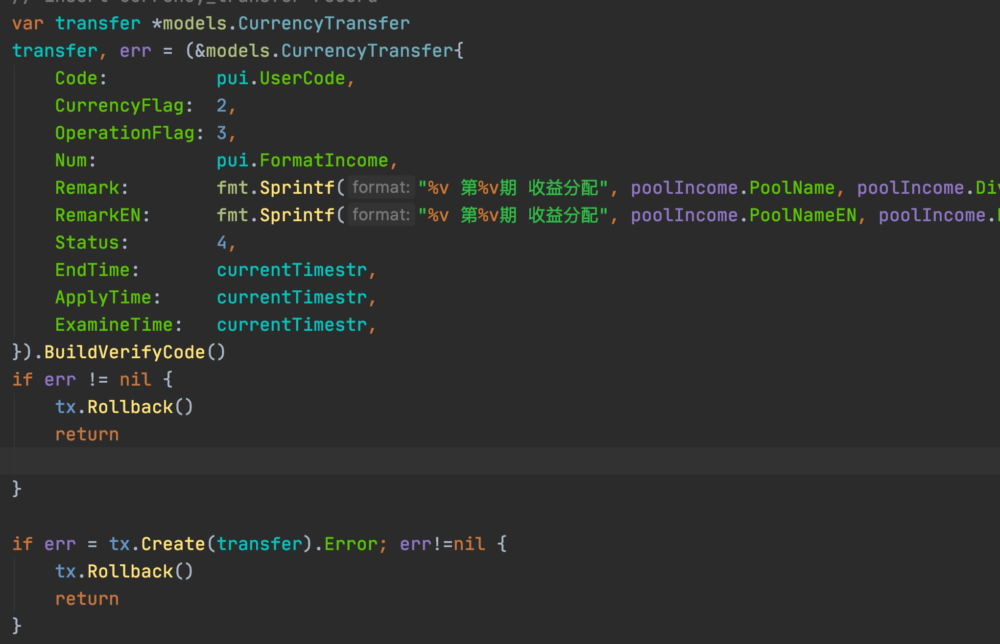


### 矿池用户收益表有问题
####  按code分组， 查矿池用户收益表
```
SELECT user_code, user_phone, user_email, space, income, format_income, create_time,  sum(format_income) as sumincome from pool_user_income GROUP BY user_code
```
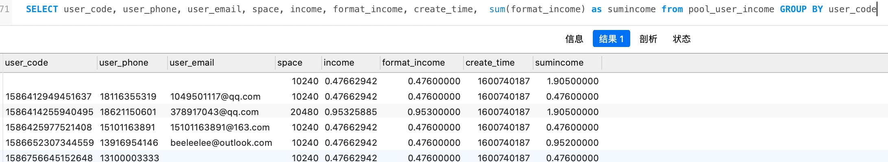

存在user_code为空的记录， 

#### 把分组展开， 看下user_code 为空的数据
```
SELECT * from pool_user_income where user_code=''
```
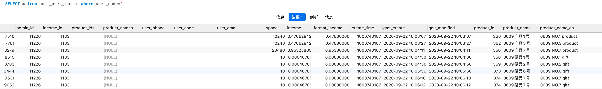
对应的代码： 
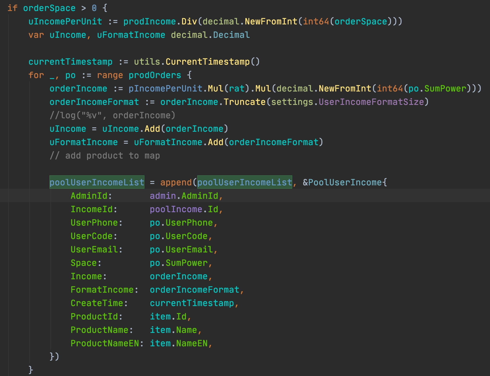

####  小结： 审核收益分配给用户时， 在矿池用户收益表和转账表都增加记录
上面两处代码都是在审核收益分配给用户时， 一个是在矿池用户收益表pool_user_income, 记录收益分给了那些用户，  一个是在用户转账表， 记录用户收到的转帐。 

### 设置断点调试， 找到根本原因： 左连接导致查询出用户已经不存在的订单

#### 对分配收益的审核通过后， 矿池用户收益表和转账表增加记录的过程 
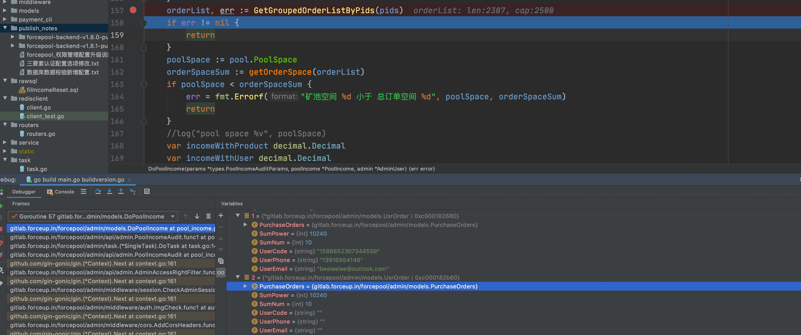
出现code为0的情况， 但里面的purchaseorder不为0， 但purchaseOrder不为0: 
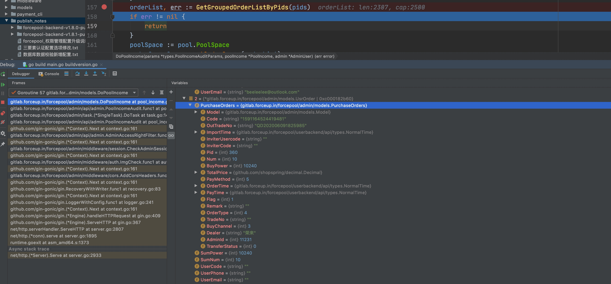

#### 根据调试定位到订单列表orderlist有问题， 查orderlist来源：
```
func GetGroupedOrderListByPids(pl []int) (pol []*UsrOrder, err error) {
	pol = make([]*UsrOrder, 0)
	err = db.Debug().Table("purchase_orders po").Select("po.*, u.code as user_code, u.phone as user_phone, u.email as user_email, sum(po.buy_power) as sum_power, sum(po.num) as sum_num").Joins("left join user u on po.code = u.code").Where("po.order_type = 4 and po.pid in (?)", pl).Group("po.pid, po.code").Find(&pol).Error
	//err = db.Debug().Model(PurchaseOrders{}).Select("*, sum(buy_power) as sum_power, sum(num) as sum_num").Where("order_type = 4 and pid in (?)", pl).Group("code").Find(&pol).Error
	return
}
```
purchase_orders 左连接 user 表，  purchase_orders 有一条记录， 但user表里没有这条记录：
purchase_orders 表里有的code 为1591164524419481:
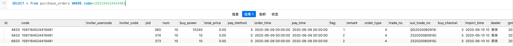
而 user 表里没有这个code：
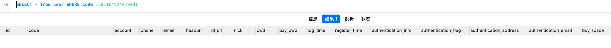


找到问题的根本原因，即是purchase_orders 左连接 user 表， 当用户表里删除了一个用户， 而购买订单里还有这个用户， 左连接的结果就是把这个没有用户的订单也查询出来。 

### 解决办法
#### 数据库中删除错误数据
1. 转账表删除没有用户的记录
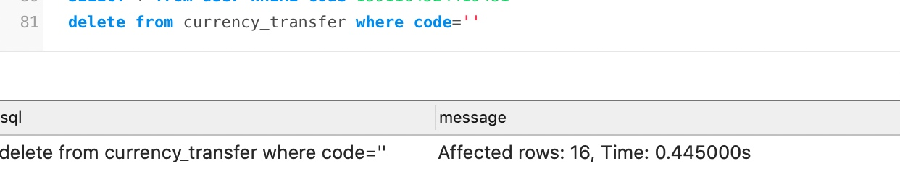
这样校验就过了：
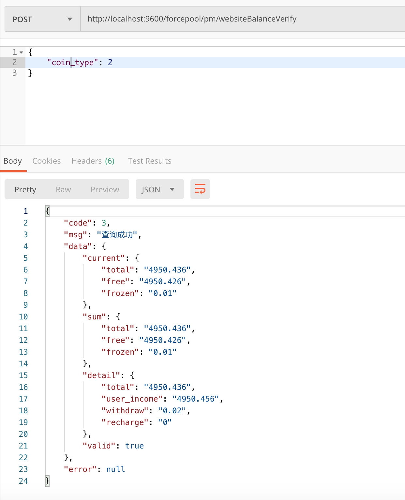

2. 相应的矿池用户收益表里也要删除，没有用户的记录：
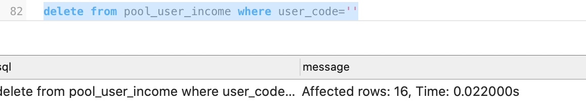

3. 
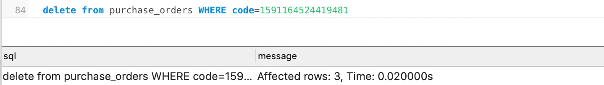

#### 代码修改
1. 将购买订单表 与 用户表 的左连接， 改为 内连接， 这样，只有购买订单表和用户表都有用户， 才会在连接中查询到， 避免查询出一个已经没有用户的订单。 
2. 增加一个接口， 对订单表和用户表的检查。 
