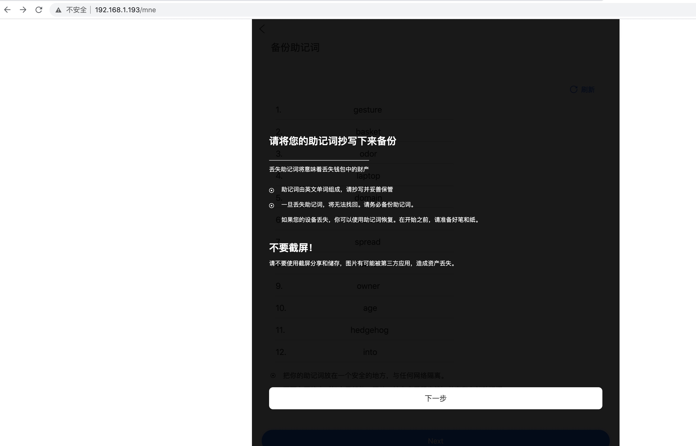
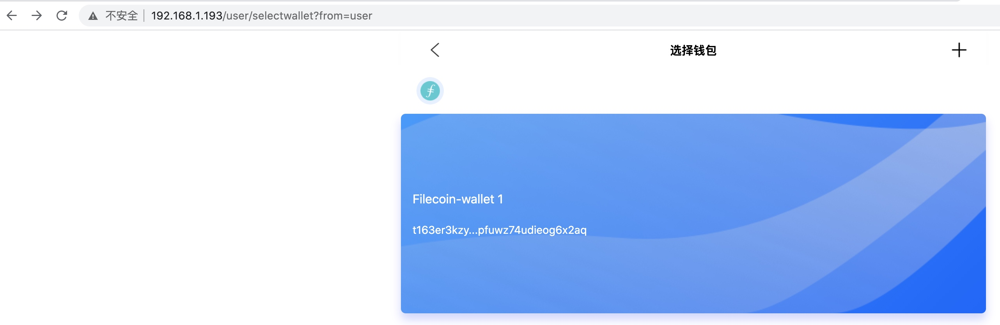
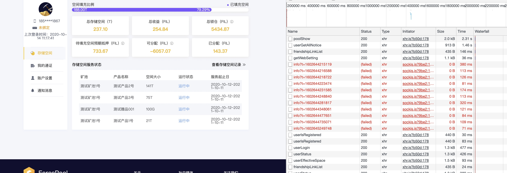

[TOC]
#### 用户管理 
 
原力矿池后台管理系统 
账号:lf
密码；a1234567

有收益分配权限的用户：
ax  
Aa1234567

超级管理员 ； 
超管  xjf   Aa1234567


delete form 


最低高度128000
worker 复制证明的
controller 时空证明的

用于系统：
有算力的用户：
18621150601   ipfs2018

replace gitlab.forceup.in/forcepool/userbackend => /Users/zhenglun1/goworkspace/forcepool/UserBackend

### 待填充空间预期抵押
待填充空间预期抵押 = （（当前初始抵押+交易抵押）/已填充空间比例）*待填充空间比例 

[Info] 2020/10/07 11:58:13 user.go:274: 总空间= 20971520 , 待填充空间大小= 20961588 , 已填充空间= 9932 当前初始抵押= 165677.5895229448023883 , 交易抵押= 0
[Info] 2020/10/07 11:58:13 user.go:276:  已填充空间比例= 0.00047359466552734377 , 待填充空间比例= 0.9995264053344727


((165677.5895229448023883 + 0) / 0.00047359466552734377) * 0.9995264053344727 = 349664254.169662253297925

鸡还在蛋里呢

我不知此物， 此物确是我所成就， 氧气的吸收，食物的消化， 血液的流动， 神经感官  每个人都是一个使用期限， 等那最后一口饭， 

前几天， 我以为实现梦想了


####  运行匡持， 运行一段时间后，产生待分配

添加一个矿池：


一般一天之后才能触发， 如果提前触发， 修改mining_time时间：

对应的数据库定义：


需要filscan那边确认， 可能会报error

最后在分配收益申请里， 产生一条待分配的记录：


然后到提现申请里， 对这条待分配的收益， 做提现申请：


增加一般地址的校验
一般地址chaininfo数据只保存在record表里
只允许0点前创建的矿工汇总到收益中
增加一般地址的历史记录功能
矿工历史收益数据记录到单独的wallet_recard表
1，矿池收益数据优先从数据库读取，数据库没有再从rpc获取. 2. 矿池收益数据记录数据库时，增强去重判断
修改订单中用户已提币错误
增加历史收益详情
### linux改系统时间
date -s "20201102 23:58:59"


####  修改系统时间 导致验证码发送失败

抱这样的错误：
```
preview: 
code: 5, msg: "发送验证码失败,请检查后重试", data: null,…}
code: 5
data: null
error: "第三方验证错误：[TencentCloudSDKError] Code=AuthFailure.SignatureExpire, Message=签名过期，请重新生成请求。, RequestId=55be409e-5e87-4e29-ad30-c0400443599f"
msg: "发送验证码失败,请检查后重试"
```

###   不同时区的时间戳问题


UNIX_TIMESTAMP 获取的时间 多了8个小时： 


解决办法也很简单，明确指定 MySQL 数据库的时区，不使用引发误解的 CST：

show variables like "%time_zone%";
system_time_zone	CST
time_zone	SYSTEM

李刚's avatar

李刚 committed about 5 hours ago
600bb8d8


mysql> set global time_zone = '+08:00';
Query OK, 0 rows affected (0.00 sec)
 
mysql> set time_zone = '+08:00';
Query OK, 0 rows affected (0.00 sec)

flush privileges;
set 之后：


修改时区的办法如下：

 仅修改当前会话的时区，停止会话失效
set time_zone = '+8:00';
修改全局的时区配置
set global time_zone = '+8:00';
flush privileges;
当然，也可以通过修改配置文件(my.cnf)的方式来实现配置，不过需要重启服务。

vim /etc/my.cnf ##在[mysqld]区域中加上
default-time_zone = '+8:00'
 /etc/init.d/mysqld restart ##重启mysql使新时区生效

### decimal 最多保持小数点后16位
12345.67890 12345 67890 1

```golang
func main() {
	//25 位数
	d, _ := decimal.NewFromString("1234567890123456789012345")
	fmt.Println("d = ", d)
	d2 := decimal.NewFromInt(10)

	d4 := d2.Pow(decimal.NewFromInt(20))
	
	a, _ := d4.Float64()
	fmt.Println("a= ", a )
	d3 := d.Div(d4)

	d5 := d3.Truncate(7)

	fmt.Println("d3 = ", d3)
	fmt.Println("d5 = ", d5)
}
```
结果：


#### 实际调试数据
```
Result = {gitlab.forceup.in/forcepool/admin/api/admin.AA·2} 
 TotalReward = {string} "206113286568752109579"
 StartHeight = {int64} 53041
 EndHeight = {int64} 53158

result = {gitlab.forceup.in/forcepool/admin/api/admin.WalletRewards} 
 Code = {int} 3
 Msg = {string} "ok"
 Data = {struct { Income float64 "json:\"income\""; Rewards float64 "json:\"rewards\""; StartHeight int64 "json:\"Max\""; EndHeight int64 "json:\"Min\"" }} 
  Income = {float64} 206.1132865687521
  Rewards = {float64} 206.1132865687521
  StartHeight = {int64} 53041
  EndHeight = {int64} 0
```
  
传入的autofil为206113286568752109579， 规整一下， 
206 113 28656 87521 09579
共3 + 18 位， 
decimal 转换后， 得到：
206.1132865687521 规整一下： 
206.113 28656 87521
小数点后为13位， decimal最多容纳13位小数。 


	poolIdModels, err := models.GetPoolIdsByUserCode(user.UserCode)
	if err != nil {
		logger.Error.Println(" models.GetPoolIdsByUserCode err ")
		return
	}
	poolIds := make([]int, 0, len(poolIdModels))
	for _, poolIdModel := range poolIdModels {
		poolIds = append(poolIds, poolIdModel.PoolId)
	}
	buySpace := user.BuySpace.Div(decimal.NewFromInt(1024))
	otherSpace := user.OtherSpace.Div(decimal.NewFromInt(1024))
	userTotalSpace := buySpace.Add(otherSpace)
	userRewards, err := models.CalculateUserRewards(user.UserCode, poolIds, userTotalSpace)
	if err != nil || userRewards == nil {
		logger.Error.Println(" models.CalculateUserRewards err  ")
		userRewards = &models.UserRewards{
			UserLockStore:           decimal.NewFromInt(0),
			UserSpaceRace:           decimal.NewFromInt(0),
			UserHasFilleedSpace:     decimal.NewFromInt(0),
			UserWaitFillSpacePledge: decimal.NewFromInt(0),
			TotalUserIncomePool:     decimal.NewFromInt(0),
		}
	}

#### pre request 


var card = CryptoJS.enc.Utf8.parse("11111")
var base64 = CryptoJS.enc.base64.stringify(card)
pm.environment.set("cardNumber", base64)  
  
  
  var card = CryptoJS.enc.Utf8.parse("11111")
var base64 = CryptoJS.enc.Base64.stringify(card)
pm.environment.set("cardNumber", base64) 


#### 超级管理员


#### API发消息
消息发不到链上的原因是， 消息的baselimit太小导致。 


### 收益分配申请
ax 没有收益分配的权限, 只能提交收益分配申请
待分配 申请： 


收益校验：

产品收益 和 矿池空间： 


提交申请： 


ax提交申请后， 进入审核中： 


### 收益分配的审核
lf： 有收益分配的审核权限，审核通过。 待lf 对收益分配进行审核： 

 
 需要输入密码，才可以审核通过


审核确认后， 需要很长时间的等待， 因为在写数据库


审核后， 大量的user_notify 插入语句：


#### 


一次访问， 两次接口掉员工，第一次是看有没有权限

### 提现相关的表
从API找到待打款列表：


所有的表都通过user_code关联
#### 转账订单表
每个待打款， 就是一个转账订单， 用上面的订单id,到currency_transfer找到这个订单：
SELECT * from currency_transfer WHERE id=15929;

currency_transfer记录了订单状态， 转账金额， 转账消息的cid, 转账的目标T3地址， 用户每申请一次提现， 就在这个表里产生一条记录。 

#### 提现的表

主要是发起提现的用户的名字， 用户的钱包T3地址

#### balance表


主要包括用户总的金额， 冻结的金额， 可用的金额， 
主要用于校验用。 


####  堆栈数据没有出来


#### singleTask
审核通过起一个任务的写法：

  对应的singleTask:  


避免一个任务没完成， 又执行下一个任务。 


#### 按结构体里指定字段排序


#### mac 查端口是否被占用


#### npm run dev 错误


解决的办法是：
npm uninstall 后， 再 npm install ， 再npm run dev 就好了： 


### 清空表
```
UPDATE pool SET mining_time = null, is_mining = 0;
UPDATE product SET mining_time = null;
DELETE from `pool_income`;
DELETE from `pool_wallet_income`;
DELETE from `pool_income_audit`;
DELETE from `pool_product_income`;
DELETE from `pool_user_income`;
DELETE FROM currency_transfer WHERE currency_flag = 2 and operation_flag = 3;
DELETE FROM currency_transfer WHERE currency_flag = 2 and operation_flag = 2;
UPDATE balance SET total_balance = 0, frozen = 0, free = 0 WHERE coin_type = 2;
DELETE from `wallet`;
DELETE FROM withdraw_wallet WHERE coin_type = 2;
DELETE from `user_notify`;
DELETE from `balance_verify_record`;
```


#### 解决因转账失败引起的用户余额校验不过的问题

用户余额校验没过， 提现审核不能通过。 

在payment 平台余额校验没过， 也不能转币：


到平台余额看下也没有过

```
{
    "code": 3,
    "msg": "查询成功",
    "data": {
        "current": {.    // balance表的
            "total": "9216.308",
            "free": "9215.248",
            "frozen": "1.06"
        },
        "sum": {。       // concunrency_transfer 表的
            "total": "9215.588",
            "free": "9215.348",
            "frozen": "0.24"
        },
        "detail": {
            "total": "9215.588",
            "user_income": "9219.128",
            "withdraw": "3.54",
            "recharge": "0"
        },
        "valid": false
    },
    "error": null
}
```
转账表的free比balance表 的free多了0.1 ， 这0.1来源于已打款， 但没有真正打款成功的： 

根本原因：
没有把失败的算到冻结里面， 导致转账表的free总和比balance表的总和多出了0.1， 正是失败转账的金额。 改为如下， 则解决： 


####  193 服务创建私钥地址步骤
http://192.168.1.193/intro 








#### 查询t1地址的所有消息

第一条为一笔转帐消息：
t163er...g6x2aq 向 t3rnln...yrkrpq 转了 0.001 FIL
### 接口问题


### payment 使用
用户名：ligang
密码： a1234567
钱包地址： t163er3kzyytp3v3xtf7nzopfuwz74udieog6x2aq

## 风险
###数据安全
#### 收益校验， 
#### 平台余额校验
用户总余额， 可用余额， 

出现校验不过时， 找不出问题数据

原有的分析接口也找不出


校验不过， 找到有问题的订单记录， 收益记录， balance记录

防篡改体现

#### 数据库主备
### 抵押涉及的收益改动

####  


### 每晚回去， 思考给第二天设立一个最小目标， 诃一个尽可能完成的目标


#### map
rpc获取数据， 将slice重新组织为map， 后续访问某一项数据，避免遍历 


#### 要有默认参数poolId:0 ， 否则报解析错误


开启挖矿前， 必须绑定物理矿工的T0地址


#### 审核权限 


### 登录时， 前段根据后端返回的角色显示出左侧菜单


####  aliyun 发送次数超过限制，  自动转到备用的tencent


#### 登录判断


原因： 

pwd字段定义的长度40太短， 没有装下密码长度

长度定义： 


decimal以字符串饭给前端： 


{
    "jsonrpc": "2.0",
    "result": [
        {
            "worker": "f023646",
            "worker_address": "f3qxs6p75hikaiaang6rc6zm3wefqbepr66sngbmyptplsnfogkjizz42dcmvhslxeqcrlps2t5hihevbsnxfa",
            "worker_last_epoch": 139824,
            "worker_balance": "2416833973560655390363",
            "controller": "f023656",
            "controller_address": "f3rmer6zxc65rrbnjkd6to524t5e2yldqx4jz6hk6f4dmvcl7qnvfjzuxz5b6pronc6azqskneojh3f44ytdla",
            "controller_last_epoch": 139804,
            "controller_balance": "529136649710965436586",
            "miner": "f023651",
            "miner_last_epoch": 139824,
            "raw_power": "4850220668026880",
            "quality_power": "4850220668026880",
            "miner_available_balance": "564474173387144430898",
            "miner_locked_funds": "10658617142113304525868",
            "miner_precommit_deposits": "863636214485002531011",
            "miner_init_pledge_required": "39644513578514601414491",
            "miner_balance": "51731241108500052902268",
            "miner_rewards": "6664164811645392860140",
            "market_locked": "0"
        },
        {
            "worker": "f020328",
            "worker_address": "f3rfpoahexgfajmzjyth7jcknhfu34ylyrfhynaofaibqz26nxcuxicub2nno7pvxc57guulsxjpqikm4ejmhq",
            "worker_last_epoch": 138721,
            "worker_balance": "250473638831026066239",
            "controller": "f020355",
            "controller_address": "f3w2zped6meoz475tgdlk77okglv4itnruovcrzpnxqjkvrorb54rddlnfoxpddg3rhzvalc7mo5pfyniqu4za",
            "controller_last_epoch": 139819,
            "controller_balance": "997287605644706509396",
            "miner": "f020330",
            "miner_last_epoch": 139820,
            "raw_power": "16974569747251200",
            "quality_power": "16974569747251200",
            "miner_available_balance": "66295553289081037842",
            "miner_locked_funds": "115028004662756159154759",
            "miner_precommit_deposits": "0",
            "miner_init_pledge_required": "189466353260225160243547",
            "miner_balance": "304560653476270400436148",
            "miner_rewards": "30057527369739293355638",
            "market_locked": "0"
        },
        {
            "worker": "f021850",
            "worker_address": "f3s54nirpk7gg5dltjhyyhovslrfyhyc5mo5efik7nbmpolwqptttmmjenup52cofud3nhpl5nsi43jdco72na",
            "worker_last_epoch": 139824,
            "worker_balance": "407974258355296950506",
            "controller": "f029661",
            "controller_address": "f3wunvkngsssv5zgcgkj7ius3r36zqhvm5ax3jsav34nsxgsttwhrt5v7p2c4xn6xkzeghekvjq6lcxj3zbntq",
            "controller_last_epoch": 139736,
            "controller_balance": "249628352587565785789",
            "miner": "f022038",
            "miner_last_epoch": 139824,
            "raw_power": "554669256474624",
            "quality_power": "554669256474624",
            "miner_available_balance": "91989818956839500915",
            "miner_locked_funds": "1683422171711203175316",
            "miner_precommit_deposits": "229182043108217986284",
            "miner_init_pledge_required": "4310318964806810716016",
            "miner_balance": "6314912998583071378531",
            "miner_rewards": "774940841755883907800",
            "market_locked": "0"
        },
        {
            "worker": "f024891",
            "worker_address": "f3r4k7vihzjxvnpewmuv37tvxd5o2ocbvmr5bncqyf6gz7hugmz7uzed3k6gbxpkpx4h4mkcatvjntc6i3f5bq",
            "worker_last_epoch": 139824,
            "worker_balance": "291048649256260017521",
            "controller": "f025001",
            "controller_address": "f3rtg3wojtyqo3zbc6hrrmimx4ccgupwluqfjuaniomskqviain2x47poehdadx7itgvqj4frkndvlir5zmima",
            "controller_last_epoch": 139789,
            "controller_balance": "250052369571765049184",
            "miner": "f024894",
            "miner_last_epoch": 139824,
            "raw_power": "208116935294976",
            "quality_power": "208116935294976",
            "miner_available_balance": "35087205392696793038",
            "miner_locked_funds": "226569991397198287829",
            "miner_precommit_deposits": "86011750275596574561",
            "miner_init_pledge_required": "1500373956843768810236",
            "miner_balance": "1848042903909260465664",
            "miner_rewards": "213677288502635078830",
            "market_locked": "0"
        },
        {
            "worker": "f024890",
            "worker_address": "f3sj7nwes7o6a5mp7xjm45ssh7ycwxoeueowiw6fgepmry7gxqb6ouzij7brnufvyuir6rhvvjivzm5scgm7fq",
            "worker_last_epoch": 139822,
            "worker_balance": "196530931113794509221",
            "controller": "f029660",
            "controller_address": "f3whfliz4evygziczq7h7frdeo3ax4s22zaiyidefvtjafwzzjhtynygablepxg2izhag4jbyqom4mdnwh3kbq",
            "controller_last_epoch": 139749,
            "controller_balance": "249824820848471848393",
            "miner": "f024895",
            "miner_last_epoch": 139822,
            "raw_power": "283192963629056",
            "quality_power": "283192963629056",
            "miner_available_balance": "52055508029718121663",
            "miner_locked_funds": "226856939524141336718",
            "miner_precommit_deposits": "196954696096578847935",
            "miner_init_pledge_required": "1955809591746770914541",
            "miner_balance": "2431676735397209220857",
            "miner_rewards": "228148561301761866759",
            "market_locked": "0"
        },
        {
            "worker": "f024134",
            "worker_address": "f3ruhkxvnk6ppcll3rr2p7shye3zhsn4sx5kydvyr6ov7vi77qmf7zzbagv5dlq65vmgtn67uxxiek3gktskiq",
            "worker_last_epoch": 139824,
            "worker_balance": "6456001337486293266939",
            "controller": "f024453",
            "controller_address": "f3uj2n7isf7xcdmjavzo7zcou4cyxhbs6co76no4ay4v2a2izdc7kajvikmgzjvid3e6ubzfwtqmhka2flkqha",
            "controller_last_epoch": 139798,
            "controller_balance": "514427823457523838515",
            "miner": "f024137",
            "miner_last_epoch": 139824,
            "raw_power": "4582249068494848",
            "quality_power": "4582249068494848",
            "miner_available_balance": "1424064198877679674712",
            "miner_locked_funds": "3435844317015154050923",
            "miner_precommit_deposits": "4354347063923902289100",
            "miner_init_pledge_required": "39214194270686277724310",
            "miner_balance": "48428449850503013739045",
            "miner_rewards": "3240100182988532298126",
            "market_locked": "12197828431472807"
        },
        {
            "worker": "f02431",
            "worker_address": "f3uopr3t7zsiibkzjw2uokzb3qm3iqgwbqwjt5q43xcffrenorkfkj2bn6al7dfek3g7rtiyrngag2dakujtwa",
            "worker_last_epoch": 138721,
            "worker_balance": "251121654250261587361",
            "controller": "f019198",
            "controller_address": "f3v3igbcgvydgnvp5e5swhmuhicwpul2poicgwnra52z3h3uanoj6leaw6nie5mkblvsumgukzeff42qzs6psq",
            "controller_last_epoch": 139803,
            "controller_balance": "250056510623338942850",
            "miner": "f02726",
            "miner_last_epoch": 139803,
            "raw_power": "741414434504704",
            "quality_power": "741414434504704",
            "miner_available_balance": "1000000000000000000",
            "miner_locked_funds": "8884042816416311795028",
            "miner_precommit_deposits": "0",
            "miner_init_pledge_required": "11321633268467251789839",
            "miner_balance": "20206676084883563584867",
            "miner_rewards": "798517784986410127112",
            "market_locked": "0"
        },
        {
            "worker": "f024482",
            "worker_address": "f3sxw2cm574k2byhi5d4ax4h556ywvi36gbbf4uvgmybtejpmp7bd5p7pvz6t2cdwifsgcreeilf7ecfeaot4a",
            "worker_last_epoch": 139824,
            "worker_balance": "716311224231157328219",
            "controller": "f024588",
            "controller_address": "f3snrt5gl4vvimzkxkg6s25bf2aztn4t3kyweqfl3l4lp4trrvxbriglytjtqnsie626ili5q36uhlza2qrwca",
            "controller_last_epoch": 139817,
            "controller_balance": "248892956830805897942",
            "miner": "f024483",
            "miner_last_epoch": 139824,
            "raw_power": "862017116176384",
            "quality_power": "862017116176384",
            "miner_available_balance": "126735194187275349057",
            "miner_locked_funds": "910586056135805904907",
            "miner_precommit_deposits": "384527292641431758165",
            "miner_init_pledge_required": "6056365127838165598408",
            "miner_balance": "7478213670802678610537",
            "miner_rewards": "815828044716425590193",
            "market_locked": "0"
        },
        {
            "worker": "f07790",
            "worker_address": "f3vbk6b5jzktrdohrwuhibvrvfg45ydpatslnl3jqveow6xplrjcfunvec3uccatdg4fbmgc2fjtxqfsk7hsfq",
            "worker_last_epoch": 139822,
            "worker_balance": "467244390272950323634",
            "controller": "f019211",
            "controller_address": "f3rj76dyxkgq3qu4ohuusbtom6qcxxgxzw2y7lwtp7qyzwgdkousfb63picdzf727dwlitnecdpohdsvo27ynq",
            "controller_last_epoch": 139778,
            "controller_balance": "269015939729482585197",
            "miner": "f07830",
            "miner_last_epoch": 139822,
            "raw_power": "3649931927617536",
            "quality_power": "3649931927617536",
            "miner_available_balance": "240795499441805914087",
            "miner_locked_funds": "39388728574458686677380",
            "miner_precommit_deposits": "159732479747094378447",
            "miner_init_pledge_required": "52722409046524192682793",
            "miner_balance": "92511665600171779652707",
            "miner_rewards": "5786498806300376516990",
            "market_locked": "0"
        },
        {
            "worker": "f020329",
            "worker_address": "f3qb3gfs6a6ebp2syqbvnoyo6i2xwdpknvqgcrrn24sy7in2iwmnudynwjgaf3cf7w2ajbbpp4shw4jt4v7juq",
            "worker_last_epoch": 138721,
            "worker_balance": "250713273901023977582",
            "controller": "f020586",
            "controller_address": "f3s2r6u7vga5yeyatela7k343jbmjeqv2mm6vwzw5islxhtrdngj6wonyvyb2k6zeuegc7jnskad23l77vuvsq",
            "controller_last_epoch": 139809,
            "controller_balance": "475432155839092637698",
            "miner": "f020331",
            "miner_last_epoch": 139809,
            "raw_power": "10136741293850624",
            "quality_power": "10136741293850624",
            "miner_available_balance": "309570298813684246120",
            "miner_locked_funds": "56904618226839939564995",
            "miner_precommit_deposits": "0",
            "miner_init_pledge_required": "89447016394596225223731",
            "miner_balance": "146661204920249849034846",
            "miner_rewards": "14998313340709705694297",
            "market_locked": "0"
        },
        {
            "worker": "f03175",
            "worker_address": "f3u2sdzeelm44uwrc6uqp4xvleheulrihabkfz5nukwioqekmst75xd3enj5fduefovzgh2elwhy4y3f7cq4yq",
            "worker_last_epoch": 138721,
            "worker_balance": "250358807683807905839",
            "controller": "f019200",
            "controller_address": "f3w5rddyce5jp4obb7gmap4bpxe73u5q2o334hl5h6i5prpninrljdq35ewtxhyre7ggdsoi4gfiasktjzejlq",
            "controller_last_epoch": 139812,
            "controller_balance": "249146061973775811055",
            "miner": "f03266",
            "miner_last_epoch": 139812,
            "raw_power": "1157064189542400",
            "quality_power": "1157064189542400",
            "miner_available_balance": "1000000000000000000",
            "miner_locked_funds": "3826765645494496731095",
            "miner_precommit_deposits": "0",
            "miner_init_pledge_required": "21000267155603763322143",
            "miner_balance": "24828032801098260053238",
            "miner_rewards": "1567595853985135245578",
            "market_locked": "0"
        },
        {
            "worker": "f021523",
            "worker_address": "f3rltzxd2bsncf52nwr4p57ltusduhkxszgiwehcbmfy2jykrnb4z3l7lno6rh33gqx54jsg2qjkcy5nbuc2xa",
            "worker_last_epoch": 139824,
            "worker_balance": "1381263408459873681918",
            "controller": "f029662",
            "controller_address": "f3rhoro23bmjqwhfiwauhlv7v5chndvfxrqmlk7wuygxychem5lpf5vq2qdw4cpogrsb4ted76wahnb4izft3q",
            "controller_last_epoch": 139646,
            "controller_balance": "241918286264859229589",
            "miner": "f021525",
            "miner_last_epoch": 139824,
            "raw_power": "3578669830242304",
            "quality_power": "3578669830242304",
            "miner_available_balance": "220970491139832953207",
            "miner_locked_funds": "8141942107021703752538",
            "miner_precommit_deposits": "1586189742245938949972",
            "miner_init_pledge_required": "28350214044236632945587",
            "miner_balance": "38299316384644108601304",
            "miner_rewards": "3046446974396203901397",
            "market_locked": "0"
        },
        {
            "worker": "f03520",
            "worker_address": "f3wz7bqe35vylwgzmzrdqwwpnx53t3fcrbupembzwzvrghpglhnacwzswi2ljluehtl6te2jbnqfonlcexcumq",
            "worker_last_epoch": 138721,
            "worker_balance": "250811667214577808472",
            "controller": "f019217",
            "controller_address": "f3xavr7iaet5lgy2ekrbvq73ugt3tyvd3xd5ef2j7j3564775g37uonvcqi7f63atlqmmvayvia34kjuhd6n4q",
            "controller_last_epoch": 139824,
            "controller_balance": "239193461757558641873",
            "miner": "f010056",
            "miner_last_epoch": 139824,
            "raw_power": "4226728855601152",
            "quality_power": "4226728855601152",
            "miner_available_balance": "176372423688346362723",
            "miner_locked_funds": "45315307905719862568846",
            "miner_precommit_deposits": "0",
            "miner_init_pledge_required": "54950305933045270450349",
            "miner_balance": "100441986262453479381918",
            "miner_rewards": "5931331453781437996559",
            "market_locked": "0"
        },
        {
            "worker": "f020515",
            "worker_address": "f3qevkrtlxzx67pmbkfdfgy4hbbng3wmdevum5jc44pw5rxbjjeo4xxalguskgyqxcsgn4wzyonenvdw3gtgdq",
            "worker_last_epoch": 138721,
            "worker_balance": "251212936557217533595",
            "controller": "f020587",
            "controller_address": "f3uykbtqho5zxottr44eufeccricazu63vitrimqcuf2ohee7fhblta64dqm6iob3wijjex6guny5b2bqcfdiq",
            "controller_last_epoch": 139820,
            "controller_balance": "485497664497625984935",
            "miner": "f020522",
            "miner_last_epoch": 139820,
            "raw_power": "7438883356672000",
            "quality_power": "7438883356672000",
            "miner_available_balance": "293621320537701523861",
            "miner_locked_funds": "52626006274042574167084",
            "miner_precommit_deposits": "0",
            "miner_init_pledge_required": "67847221042186932425306",
            "miner_balance": "120766848636767208116251",
            "miner_rewards": "11168836258553042335413",
            "market_locked": "0"
        },
        {
            "worker": "f03357",
            "worker_address": "f3wk3lmwl4p55xk2oihjbh5ag4zmeq662ndfwvusdzsedk2m4kbvfivpbip2iua4lbu6bvrat7swryyd5tnvsa",
            "worker_last_epoch": 138721,
            "worker_balance": "250325815876378243589",
            "controller": "f019209",
            "controller_address": "f3wilekov3iv4pqiuoinpfkkj3mosgqpa7hwhqewklytofbf3in4eupqj6fngtw57wee3fvzk3cmfxsvdiwxqa",
            "controller_last_epoch": 139020,
            "controller_balance": "243472561081488698356",
            "miner": "f03367",
            "miner_last_epoch": 139818,
            "raw_power": "1492758833397760",
            "quality_power": "1492758833397760",
            "miner_available_balance": "117292086084627783804",
            "miner_locked_funds": "19509378021030748407439",
            "miner_precommit_deposits": "5730986202766598972",
            "miner_init_pledge_required": "20605614516929400559684",
            "miner_balance": "40238015610247543349899",
            "miner_rewards": "2295338113925410415051",
            "market_locked": "0"
        },
        {
            "worker": "f018999",
            "worker_address": "f3s5kn43spd5zggpgpajyct7aj25mgc5ocxaxv72mmknr76usi5ronfxix6bee2dmkxtw33wh5yx5yju4gjh2q",
            "worker_last_epoch": 139816,
            "worker_balance": "252145061603035527778",
            "controller": "f019227",
            "controller_address": "f3qd63apkpwu5alejt7crzjhhavxc25hvflml64ghofzgpbeetu35shztkesdrtsxd4gv2lin2nqeqkaukdh3a",
            "controller_last_epoch": 138721,
            "controller_balance": "286380350788161257233",
            "miner": "f019002",
            "miner_last_epoch": 139816,
            "raw_power": "270376781217792",
            "quality_power": "270376781217792",
            "miner_available_balance": "8387003461820607046",
            "miner_locked_funds": "1814191218697144019776",
            "miner_precommit_deposits": "39300091894308953821",
            "miner_init_pledge_required": "2578585562521493833647",
            "miner_balance": "4440463876574767414290",
            "miner_rewards": "418137503000716445919",
            "market_locked": "0"
        },
        {
            "worker": "f024798",
            "worker_address": "f3uqetqpocsdryrytbutlv7m75flsdalg4xwblvgpxwemt3km6gzpi4b3hp7qqntqspaap5dn2ompkos3uayxq",
            "worker_last_epoch": 139822,
            "worker_balance": "711261981061721273471",
            "controller": "f024945",
            "controller_address": "f3xeaasrmcfaddd3qmfvs3ybfdk6fmtbi5jphh6x2klm23ax6pt4axfy2mtkaacnbiwwj4qoexggmxanmi4gxq",
            "controller_last_epoch": 139778,
            "controller_balance": "249850566749382399677",
            "miner": "f024802",
            "miner_last_epoch": 139822,
            "raw_power": "289858752872448",
            "quality_power": "289858752872448",
            "miner_available_balance": "48061304755245992804",
            "miner_locked_funds": "318373773171838750886",
            "miner_precommit_deposits": "126522497728854748045",
            "miner_init_pledge_required": "2004154146111397037158",
            "miner_balance": "2497111721767336528893",
            "miner_rewards": "306923964975598756592",
            "market_locked": "0"
        },
        {
            "worker": "f025000",
            "worker_address": "f3v4ww2ac5o6l4djogf23gb4pnosre7m7374qw3rsocts73nfhy5ecvwzmyut3n4jkcoddqhe7sli77tsbi7ma",
            "worker_last_epoch": 139685,
            "worker_balance": "2196823701965732317831",
            "controller": "f029657",
            "controller_address": "f3s3qvu4nvgurtp5qm5rvc7i7qos5fwjgwbqi6itxzleqzrgts24xhongr4d7pm7z5tgkhacruytsq3zrzhrua",
            "controller_last_epoch": 138721,
            "controller_balance": "245994911493513835135",
            "miner": "f025002",
            "miner_last_epoch": 139821,
            "raw_power": "962484991164416",
            "quality_power": "962484991164416",
            "miner_available_balance": "199861710283848252477",
            "miner_locked_funds": "769801483628563929363",
            "miner_precommit_deposits": "212606805943284604326",
            "miner_init_pledge_required": "6636482744414276022095",
            "miner_balance": "7818752744269972808261",
            "miner_rewards": "821692207934294413439",
            "market_locked": "0"
        },
        {
            "worker": "f01106",
            "worker_address": "f3uuvgrmepryqhcpmxtcucbjsbasvcl4k226lkiyl4v7ko75zqirrbsys7jt3cqxb5jgviubit5jcfkzqbsa6a",
            "worker_last_epoch": 138721,
            "worker_balance": "250277354243853503206",
            "controller": "f019149",
            "controller_address": "f3uyhedljg5iukehape6vu6y3k6jnqbku3szxpippwvuvqi6ygknt7sgnqt6urcdbvi2kir6t4ebromaojrncq",
            "controller_last_epoch": 139774,
            "controller_balance": "470165274680789241386",
            "miner": "f02438",
            "miner_last_epoch": 139805,
            "raw_power": "10678353849745408",
            "quality_power": "10678353849745408",
            "miner_available_balance": "924007410571094843557",
            "miner_locked_funds": "174197443511502629557481",
            "miner_precommit_deposits": "0",
            "miner_init_pledge_required": "165677589522944802388340",
            "miner_balance": "340799040445018526789378",
            "miner_rewards": "15884201315266980233804",
            "market_locked": "0"
        },
        {
            "worker": "f01233",
            "worker_address": "f3rht5rhzn7kgdsj4qeph6psviaaj3ayob4uexmz7yiutbt4itu575rchdf3uuelkqjf47r46atxcpw6ogg6xa",
            "worker_last_epoch": 138721,
            "worker_balance": "250806305116138083078",
            "controller": "f019177",
            "controller_address": "f3skajkyw5dactfqgaoei45aq3rpgti4n6lk4zffjjdpdxesfvaia7gooszdtn6gxcmwd5nks3yqvszbuy6hpa",
            "controller_last_epoch": 139773,
            "controller_balance": "486576771069478730843",
            "miner": "f02425",
            "miner_last_epoch": 139824,
            "raw_power": "5484673236992000",
            "quality_power": "5484673236992000",
            "miner_available_balance": "327477707859378278760",
            "miner_locked_funds": "63528729695522542017981",
            "miner_precommit_deposits": "0",
            "miner_init_pledge_required": "73482138773340092609939",
            "miner_balance": "137338346176722012906680",
            "miner_rewards": "8233220868099628011995",
            "market_locked": "0"
        },
        {
            "worker": "f01230",
            "worker_address": "f3rnlnagjk5wlk23q3lwlaqq7afy2gvtglxr2mltmbbzh4udxeabnl46pstnxtghbya45fxr4f67dyg2yrkrpq",
            "worker_last_epoch": 138721,
            "worker_balance": "250243467090637274408",
            "controller": "f019175",
            "controller_address": "f3usqe5nrbftyk2n34y5waxlqodqqn6ldqrj7ybdhlltnm46vphzvxt7glafwzll545sdaxh3csggrhm3hwcnq",
            "controller_last_epoch": 139802,
            "controller_balance": "476024359506042667170",
            "miner": "f02731",
            "miner_last_epoch": 139819,
            "raw_power": "6893010193219584",
            "quality_power": "6893010193219584",
            "miner_available_balance": "468479531952284482258",
            "miner_locked_funds": "94723019729872758780360",
            "miner_precommit_deposits": "0",
            "miner_init_pledge_required": "124793475196989280304969",
            "miner_balance": "219984974458814323567587",
            "miner_rewards": "13787840718455354409485",
            "market_locked": "0"
        },
        {
            "worker": "f020603",
            "worker_address": "f3swecvrv53utxeeniux64gjjqsc3mkcz7dhleopfttshx5t3omopxuaqbqnbzh24icpnj6pzt4aqfil2vaxwa",
            "worker_last_epoch": 138721,
            "worker_balance": "250819771070402206113",
            "controller": "f020616",
            "controller_address": "f3u6jgpmfulcysqhyqor54h23zi5obnfvogmkcvr2qfpxhss4cq6oqwluaqpult3gk3o7z5n3pvp55b7ymjgja",
            "controller_last_epoch": 139816,
            "controller_balance": "496976308635890461903",
            "miner": "f020604",
            "miner_last_epoch": 139816,
            "raw_power": "2983524801970176",
            "quality_power": "2983524801970176",
            "miner_available_balance": "143946063145493171926",
            "miner_locked_funds": "25104861478959064181423",
            "miner_precommit_deposits": "0",
            "miner_init_pledge_required": "28391854036335925055047",
            "miner_balance": "53640661578440482408396",
            "miner_rewards": "4146007027332641890137",
            "market_locked": "0"
        },
        {
            "worker": "f023204",
            "worker_address": "f3rjt5gk5ocmj56n3jpozaop5e2qjwbbqve7l2wsfk3h4xvei7seetqqs4kdvbiy52mwtcbzxqmzlfwddsd5ta",
            "worker_last_epoch": 139824,
            "worker_balance": "7816680699250682829727",
            "controller": "f023666",
            "controller_address": "f3wg3yptdfk5rdqqm645gq2neuzj5nakg3o7v6z2tmb53mif4rfmedb5plqx7n5rb4hthtpajwurgfoiyqf23q",
            "controller_last_epoch": 139796,
            "controller_balance": "496836876192008456174",
            "miner": "f023205",
            "miner_last_epoch": 139824,
            "raw_power": "12314358432399360",
            "quality_power": "12314358432399360",
            "miner_available_balance": "1510886297689033393661",
            "miner_locked_funds": "23472801700486643646338",
            "miner_precommit_deposits": "2831017978833102883106",
            "miner_init_pledge_required": "97582695118578852010062",
            "miner_balance": "125397401095587631933167",
            "miner_rewards": "13186306419850262102304",
            "market_locked": "13039613151153590"
        },
        {
            "worker": "f03247",
            "worker_address": "f3spenr5xkybb2zx6af4c7ljk5peklknu6kylw3qf6piro366ab7pxgpj7tnlrfahcpsfz3tcskxwqpz4twb2q",
            "worker_last_epoch": 138721,
            "worker_balance": "250862604047806843295",
            "controller": "f019203",
            "controller_address": "f3shk4utsbtdqerq3db2wbkfqlfg7w3cw3jxxym2yza6hpxrzrs6hte2wkzzaymazvvgzdhkvyd4z5wjodyoxa",
            "controller_last_epoch": 139818,
            "controller_balance": "249261860113163544822",
            "miner": "f03287",
            "miner_last_epoch": 139818,
            "raw_power": "1680397364625408",
            "quality_power": "1680397364625408",
            "miner_available_balance": "1000000000000000000",
            "miner_locked_funds": "14524693917599897243437",
            "miner_precommit_deposits": "0",
            "miner_init_pledge_required": "25573501311163750976519",
            "miner_balance": "40099195228763648219956",
            "miner_rewards": "2691080295093460971251",
            "market_locked": "0"
        },
        {
            "worker": "f02320",
            "worker_address": "f3qbamjie544fgpak66dncwcxvvo43rjvu5slz3xfcelkihgsoejexmrotxozo3sls6x2facttkusyndh3kbda",
            "worker_last_epoch": 138721,
            "worker_balance": "538949438414441602174",
            "controller": "f019212",
            "controller_address": "f3wae5qbwpjohiavmvcnnnjnfd7zidmev6jdpeykydmkpsmb2irr2ci2pheo4mv5lqmt6e7cczpsnnqlfg5p7q",
            "controller_last_epoch": 138785,
            "controller_balance": "1074377579180872450479",
            "miner": "f02610",
            "miner_last_epoch": 139782,
            "raw_power": "389845591523328",
            "quality_power": "389845591523328",
            "miner_available_balance": "959722656657786919328",
            "miner_locked_funds": "5145132507139483803703",
            "miner_precommit_deposits": "0",
            "miner_init_pledge_required": "5440342895481278766154",
            "miner_balance": "11545198059278549489185",
            "miner_rewards": "468996517347757661969",
            "market_locked": "0"
        },
        {
            "worker": "f02517",
            "worker_address": "f3r4swytt2mlnjo3dly43gvfbxvgkynrcs3fj67bx7dbd7l7zjwg4qm2o7cxnyhcbcqs33gvgnkwch4yrkpu2a",
            "worker_last_epoch": 138721,
            "worker_balance": "250902540488176965005",
            "controller": "f019205",
            "controller_address": "f3uggt5qa4fah4t2xdz2untdfp2r23hvfvbjsfiwl5loraktdo7rw24mnzhxmoqkfkvk425kqqsjyt7syqmlja",
            "controller_last_epoch": 139672,
            "controller_balance": "251138616907681435691",
            "miner": "f02721",
            "miner_last_epoch": 139775,
            "raw_power": "723959687413760",
            "quality_power": "723959687413760",
            "miner_available_balance": "17233001178568149077",
            "miner_locked_funds": "11364349761438894218449",
            "miner_precommit_deposits": "0",
            "miner_init_pledge_required": "11462969076221814243271",
            "miner_balance": "22844551838839276610797",
            "miner_rewards": "1056401118377669862256",
            "market_locked": "0"
        }
    ]
}


 "worker_balance": "250811667214577808472",
 
     "worker_balance": "250811667214577808472",
     
     




#### 字段名SpaceRaceId 自动生成为 space_race_id


数据库： 


没有任何提示的退出， 是端口被占用， 但log没提示， 正常是这样：


2020-10-15T10:30:32.483+0800    info    user-backend/main.go:71 路由设置完成...... 
2020-10-15T10:30:32.483+0800    fatal   user-backend/main.go:87 listen: listen tcp :9610: bind: address already in use
94f2fed6 
论眼见为虚


二、修改数据库字符集

alter database 数据库名 character set utf8;

ps:修改完数据库字符集，需要重启mysql数据库。

三、修改表字符集

ALTER TABLE 表名 DEFAULT CHARACTER SET utf8 COLLATE utf8_general_ci

四、修改列字符集

ALTER TABLE 表名 CHANGE 列名 列名 VARCHAR( 100 ) CHARACTER SET utf8 COLLATE utf8_general_ci NULL DEFAULT NULL;

#### 代码为响应生产commitid会推， master分支回退到指定提交点 


#### 111


####   找到所有需要修改的字符集，


#####   sql

SELECT table_name, table_type, engine, version, table_collation FROM information_schema.tables WHERE table_schema = 
'forcepool_test' ORDER BY table_name DESC;

SELECT TABLE_NAME,CONCAT('ALTER TABLE  ',TABLE_NAME,' DEFAULT CHARACTER SET ',a.DEFAULT_CHARACTER_SET_NAME,' COLLATE ',a.DEFAULT_COLLATION_NAME,';') executeSQL FROM information_schema.SCHEMATA a,information_schema.TABLES b
WHERE a.SCHEMA_NAME=b.TABLE_SCHEMA
AND a.DEFAULT_COLLATION_NAME!=b.TABLE_COLLATION
AND b.TABLE_SCHEMA='forcepool_test' 


####  123
 mining poolid= 6 , totalPoolSpace= 121801 , userBuySpaceByOnePoolValue= 237.09765625 , poolspacerace= 0 ，poolTotalBalance= 900738.4307722507813021 , totalUserBalanceByOnePool= 8.01558764323542254281786450831512


####  配置数据：

backend:
rbac_policy.csv 文件中添加:
p, *, /forcepool/admin/adminPoolShow, *, allow
p, loan_role, /forcepool/admin/loanlist, *, allow
p, loan_role, /forcepool/admin/borrow, *, allow
p, loan_role, /forcepool/admin/payback, *, allow
p, special_rewards_role, /forcepool/admin/spaceRaceAllocateList, *, allow
p, special_rewards_role, /forcepool/admin/allocateSpaceRace, *, allow
p, special_rewards_role, /forcepool/admin/getSpaceRaceAllocateDetail, *, allow


page_api_ref.json 文件中添加：
     { "name":"finance",
        "description": "财务",
        "child_settings": [
          [{ "description": "提现申请审核", "role": "withdraw_auditor" }],
          [{ "description": "查看账单明细", "role": "bill_watcher" }],
          [{ "description": "收益分配申请", "role": "income_distributer_claimer" }],
          [{ "description": "收益分配审核", "role": "income_distributer_auditor"}],
          [{ "description": "财务设置", "role": "financial_setor" }],
          [{ "description": "查看收益分配记录", "role": "income_distribute_watcher" }],
// 以下四个为新增：
          [{ "description": "平台余额校验", "role": "balance_inspector" }],
          [{ "description": "矿池收益", "role": "pool_income_role" }],
          [{ "description": "贷款记录", "role": "loan_role" }],
          [{ "description": "特别奖励", "role": "special_rewards_role" }]
        ]
      },
      
app.toml 修改： 
filscanApi 修改
[prodcuct]
database  修改

admin重启后，
看数据库字符集， 所有表都改为utf8


##### 修改

ALTER TABLE  batch_purchase_orders DEFAULT CHARACTER SET utf8 COLLATE utf8_general_ci;
ALTER TABLE  pool_dividend DEFAULT CHARACTER SET utf8 COLLATE utf8_general_ci;
ALTER TABLE  pool_dividend_detailed DEFAULT CHARACTER SET utf8 COLLATE utf8_general_ci;
ALTER TABLE  pool_product_income DEFAULT CHARACTER SET utf8 COLLATE utf8_general_ci;
ALTER TABLE  pool_wallet DEFAULT CHARACTER SET utf8 COLLATE utf8_general_ci;
ALTER TABLE  wallet DEFAULT CHARACTER SET utf8 COLLATE utf8_general_ci;
ALTER TABLE  wallet_history DEFAULT CHARACTER SET utf8 COLLATE utf8_general_ci;
#### 看commitid


点history

{
    "jsonrpc": "2.0",
    "result": [
        {
            "worker": "f023646",
            "worker_address": "f3qxs6p75hikaiaang6rc6zm3wefqbepr66sngbmyptplsnfogkjizz42dcmvhslxeqcrlps2t5hihevbsnxfa",
            "worker_last_epoch": 139825,
            "worker_balance": "2415115793230628050450",
            "controller": "f023656",
            "controller_address": "f3rmer6zxc65rrbnjkd6to524t5e2yldqx4jz6hk6f4dmvcl7qnvfjzuxz5b6pronc6azqskneojh3f44ytdla",
            "controller_last_epoch": 139804,
            "controller_balance": "529136649710965436586",
            "miner": "f023651",
            "miner_last_epoch": 139825,
            "raw_power": "4850220668026880",
            "quality_power": "4850220668026880",
            "miner_available_balance": "564630195091373493343",
            "miner_locked_funds": "10658617142113304525868",
            "miner_precommit_deposits": "865198332418309697141",
            "miner_init_pledge_required": "39644513578514601414491",
            "miner_balance": "51732959248137589130843",
            "miner_rewards": "6664164811645392860140",
            "market_locked": "0"
        },
        {
            "worker": "f020328",
            "worker_address": "f3rfpoahexgfajmzjyth7jcknhfu34ylyrfhynaofaibqz26nxcuxicub2nno7pvxc57guulsxjpqikm4ejmhq",
            "worker_last_epoch": 138721,
            "worker_balance": "250473638831026066239",
            "controller": "f020355",
            "controller_address": "f3w2zped6meoz475tgdlk77okglv4itnruovcrzpnxqjkvrorb54rddlnfoxpddg3rhzvalc7mo5pfyniqu4za",
            "controller_last_epoch": 139819,
            "controller_balance": "997287605644706509396",
            "miner": "f020330",
            "miner_last_epoch": 139820,
            "raw_power": "16974569747251200",
            "quality_power": "16974569747251200",
            "miner_available_balance": "66295553289081037842",
            "miner_locked_funds": "115028004662756159154759",
            "miner_precommit_deposits": "0",
            "miner_init_pledge_required": "189466353260225160243547",
            "miner_balance": "304560653476270400436148",
            "miner_rewards": "30057527369739293355638",
            "market_locked": "0"
        },
        {
            "worker": "f021850",
            "worker_address": "f3s54nirpk7gg5dltjhyyhovslrfyhyc5mo5efik7nbmpolwqptttmmjenup52cofud3nhpl5nsi43jdco72na",
            "worker_last_epoch": 139824,
            "worker_balance": "407974258355296950506",
            "controller": "f029661",
            "controller_address": "f3wunvkngsssv5zgcgkj7ius3r36zqhvm5ax3jsav34nsxgsttwhrt5v7p2c4xn6xkzeghekvjq6lcxj3zbntq",
            "controller_last_epoch": 139736,
            "controller_balance": "249628352587565785789",
            "miner": "f022038",
            "miner_last_epoch": 139824,
            "raw_power": "554669256474624",
            "quality_power": "554669256474624",
            "miner_available_balance": "91989818956839500915",
            "miner_locked_funds": "1683422171711203175316",
            "miner_precommit_deposits": "229182043108217986284",
            "miner_init_pledge_required": "4310318964806810716016",
            "miner_balance": "6314912998583071378531",
            "miner_rewards": "774940841755883907800",
            "market_locked": "0"
        },
        {
            "worker": "f024891",
            "worker_address": "f3r4k7vihzjxvnpewmuv37tvxd5o2ocbvmr5bncqyf6gz7hugmz7uzed3k6gbxpkpx4h4mkcatvjntc6i3f5bq",
            "worker_last_epoch": 139824,
            "worker_balance": "291048649256260017521",
            "controller": "f025001",
            "controller_address": "f3rtg3wojtyqo3zbc6hrrmimx4ccgupwluqfjuaniomskqviain2x47poehdadx7itgvqj4frkndvlir5zmima",
            "controller_last_epoch": 139789,
            "controller_balance": "250052369571765049184",
            "miner": "f024894",
            "miner_last_epoch": 139824,
            "raw_power": "208116935294976",
            "quality_power": "208116935294976",
            "miner_available_balance": "35087205392696793038",
            "miner_locked_funds": "226569991397198287829",
            "miner_precommit_deposits": "86011750275596574561",
            "miner_init_pledge_required": "1500373956843768810236",
            "miner_balance": "1848042903909260465664",
            "miner_rewards": "213677288502635078830",
            "market_locked": "0"
        },
        {
            "worker": "f024890",
            "worker_address": "f3sj7nwes7o6a5mp7xjm45ssh7ycwxoeueowiw6fgepmry7gxqb6ouzij7brnufvyuir6rhvvjivzm5scgm7fq",
            "worker_last_epoch": 139825,
            "worker_balance": "196187292140035843730",
            "controller": "f029660",
            "controller_address": "f3whfliz4evygziczq7h7frdeo3ax4s22zaiyidefvtjafwzzjhtynygablepxg2izhag4jbyqom4mdnwh3kbq",
            "controller_last_epoch": 139749,
            "controller_balance": "249824820848471848393",
            "miner": "f024895",
            "miner_last_epoch": 139825,
            "raw_power": "283192963629056",
            "quality_power": "283192963629056",
            "miner_available_balance": "52086715813819823267",
            "miner_locked_funds": "226856939524141336718",
            "miner_precommit_deposits": "197267119683240281161",
            "miner_init_pledge_required": "1955809591746770914541",
            "miner_balance": "2432020366767972355687",
            "miner_rewards": "228148561301761866759",
            "market_locked": "0"
        },
        {
            "worker": "f024134",
            "worker_address": "f3ruhkxvnk6ppcll3rr2p7shye3zhsn4sx5kydvyr6ov7vi77qmf7zzbagv5dlq65vmgtn67uxxiek3gktskiq",
            "worker_last_epoch": 139825,
            "worker_balance": "6453767677168424663185",
            "controller": "f024453",
            "controller_address": "f3uj2n7isf7xcdmjavzo7zcou4cyxhbs6co76no4ay4v2a2izdc7kajvikmgzjvid3e6ubzfwtqmhka2flkqha",
            "controller_last_epoch": 139798,
            "controller_balance": "514427823457523838515",
            "miner": "f024137",
            "miner_last_epoch": 139825,
            "raw_power": "4582249068494848",
            "quality_power": "4582249068494848",
            "miner_available_balance": "1424267049474340735138",
            "miner_locked_funds": "3435844317015154050923",
            "miner_precommit_deposits": "4356377817237201605069",
            "miner_init_pledge_required": "39214194270686277724310",
            "miner_balance": "48430683454412974115440",
            "miner_rewards": "3240100182988532298126",
            "market_locked": "12197828431472807"
        },
        {
            "worker": "f02431",
            "worker_address": "f3uopr3t7zsiibkzjw2uokzb3qm3iqgwbqwjt5q43xcffrenorkfkj2bn6al7dfek3g7rtiyrngag2dakujtwa",
            "worker_last_epoch": 138721,
            "worker_balance": "251121654250261587361",
            "controller": "f019198",
            "controller_address": "f3v3igbcgvydgnvp5e5swhmuhicwpul2poicgwnra52z3h3uanoj6leaw6nie5mkblvsumgukzeff42qzs6psq",
            "controller_last_epoch": 139803,
            "controller_balance": "250056510623338942850",
            "miner": "f02726",
            "miner_last_epoch": 139825,
            "raw_power": "741414434504704",
            "quality_power": "741414434504704",
            "miner_available_balance": "1000000000000000000",
            "miner_locked_funds": "8894571015961861561264",
            "miner_precommit_deposits": "0",
            "miner_init_pledge_required": "11321633268467251789839",
            "miner_balance": "20217204284429113351103",
            "miner_rewards": "809045983672298301571",
            "market_locked": "0"
        },
        {
            "worker": "f024482",
            "worker_address": "f3sxw2cm574k2byhi5d4ax4h556ywvi36gbbf4uvgmybtejpmp7bd5p7pvz6t2cdwifsgcreeilf7ecfeaot4a",
            "worker_last_epoch": 139825,
            "worker_balance": "715967601552609856869",
            "controller": "f024588",
            "controller_address": "f3snrt5gl4vvimzkxkg6s25bf2aztn4t3kyweqfl3l4lp4trrvxbriglytjtqnsie626ili5q36uhlza2qrwca",
            "controller_last_epoch": 139817,
            "controller_balance": "248892956830805897942",
            "miner": "f024483",
            "miner_last_epoch": 139825,
            "raw_power": "862017116176384",
            "quality_power": "862017116176384",
            "miner_available_balance": "126766384755097605086",
            "miner_locked_funds": "910586056135805904907",
            "miner_precommit_deposits": "384839716228093191391",
            "miner_init_pledge_required": "6056365127838165598408",
            "miner_balance": "7478557284957162299792",
            "miner_rewards": "815828044716425590193",
            "market_locked": "0"
        },
        {
            "worker": "f07790",
            "worker_address": "f3vbk6b5jzktrdohrwuhibvrvfg45ydpatslnl3jqveow6xplrjcfunvec3uccatdg4fbmgc2fjtxqfsk7hsfq",
            "worker_last_epoch": 139822,
            "worker_balance": "467244390272950323634",
            "controller": "f019211",
            "controller_address": "f3rj76dyxkgq3qu4ohuusbtom6qcxxgxzw2y7lwtp7qyzwgdkousfb63picdzf727dwlitnecdpohdsvo27ynq",
            "controller_last_epoch": 139778,
            "controller_balance": "269015939729482585197",
            "miner": "f07830",
            "miner_last_epoch": 139822,
            "raw_power": "3649931927617536",
            "quality_power": "3649931927617536",
            "miner_available_balance": "240795499441805914087",
            "miner_locked_funds": "39388728574458686677380",
            "miner_precommit_deposits": "159732479747094378447",
            "miner_init_pledge_required": "52722409046524192682793",
            "miner_balance": "92511665600171779652707",
            "miner_rewards": "5786498806300376516990",
            "market_locked": "0"
        },
        {
            "worker": "f020329",
            "worker_address": "f3qb3gfs6a6ebp2syqbvnoyo6i2xwdpknvqgcrrn24sy7in2iwmnudynwjgaf3cf7w2ajbbpp4shw4jt4v7juq",
            "worker_last_epoch": 138721,
            "worker_balance": "250713273901023977582",
            "controller": "f020586",
            "controller_address": "f3s2r6u7vga5yeyatela7k343jbmjeqv2mm6vwzw5islxhtrdngj6wonyvyb2k6zeuegc7jnskad23l77vuvsq",
            "controller_last_epoch": 139809,
            "controller_balance": "475432155839092637698",
            "miner": "f020331",
            "miner_last_epoch": 139809,
            "raw_power": "10136741293850624",
            "quality_power": "10136741293850624",
            "miner_available_balance": "309570298813684246120",
            "miner_locked_funds": "56904618226839939564995",
            "miner_precommit_deposits": "0",
            "miner_init_pledge_required": "89447016394596225223731",
            "miner_balance": "146661204920249849034846",
            "miner_rewards": "14998313340709705694297",
            "market_locked": "0"
        },
        {
            "worker": "f03175",
            "worker_address": "f3u2sdzeelm44uwrc6uqp4xvleheulrihabkfz5nukwioqekmst75xd3enj5fduefovzgh2elwhy4y3f7cq4yq",
            "worker_last_epoch": 138721,
            "worker_balance": "250358807683807905839",
            "controller": "f019200",
            "controller_address": "f3w5rddyce5jp4obb7gmap4bpxe73u5q2o334hl5h6i5prpninrljdq35ewtxhyre7ggdsoi4gfiasktjzejlq",
            "controller_last_epoch": 139812,
            "controller_balance": "249146061973775811055",
            "miner": "f03266",
            "miner_last_epoch": 139812,
            "raw_power": "1157064189542400",
            "quality_power": "1157064189542400",
            "miner_available_balance": "1000000000000000000",
            "miner_locked_funds": "3826765645494496731095",
            "miner_precommit_deposits": "0",
            "miner_init_pledge_required": "21000267155603763322143",
            "miner_balance": "24828032801098260053238",
            "miner_rewards": "1567595853985135245578",
            "market_locked": "0"
        },
        {
            "worker": "f021523",
            "worker_address": "f3rltzxd2bsncf52nwr4p57ltusduhkxszgiwehcbmfy2jykrnb4z3l7lno6rh33gqx54jsg2qjkcy5nbuc2xa",
            "worker_last_epoch": 139824,
            "worker_balance": "1381263408459873681918",
            "controller": "f029662",
            "controller_address": "f3rhoro23bmjqwhfiwauhlv7v5chndvfxrqmlk7wuygxychem5lpf5vq2qdw4cpogrsb4ted76wahnb4izft3q",
            "controller_last_epoch": 139646,
            "controller_balance": "241918286264859229589",
            "miner": "f021525",
            "miner_last_epoch": 139824,
            "raw_power": "3578669830242304",
            "quality_power": "3578669830242304",
            "miner_available_balance": "220970491139832953207",
            "miner_locked_funds": "8141942107021703752538",
            "miner_precommit_deposits": "1586189742245938949972",
            "miner_init_pledge_required": "28350214044236632945587",
            "miner_balance": "38299316384644108601304",
            "miner_rewards": "3046446974396203901397",
            "market_locked": "0"
        },
        {
            "worker": "f03520",
            "worker_address": "f3wz7bqe35vylwgzmzrdqwwpnx53t3fcrbupembzwzvrghpglhnacwzswi2ljluehtl6te2jbnqfonlcexcumq",
            "worker_last_epoch": 138721,
            "worker_balance": "250811667214577808472",
            "controller": "f019217",
            "controller_address": "f3xavr7iaet5lgy2ekrbvq73ugt3tyvd3xd5ef2j7j3564775g37uonvcqi7f63atlqmmvayvia34kjuhd6n4q",
            "controller_last_epoch": 139824,
            "controller_balance": "239193461757558641873",
            "miner": "f010056",
            "miner_last_epoch": 139824,
            "raw_power": "4226728855601152",
            "quality_power": "4226728855601152",
            "miner_available_balance": "176372423688346362723",
            "miner_locked_funds": "45315307905719862568846",
            "miner_precommit_deposits": "0",
            "miner_init_pledge_required": "54950305933045270450349",
            "miner_balance": "100441986262453479381918",
            "miner_rewards": "5931331453781437996559",
            "market_locked": "0"
        },
        {
            "worker": "f020515",
            "worker_address": "f3qevkrtlxzx67pmbkfdfgy4hbbng3wmdevum5jc44pw5rxbjjeo4xxalguskgyqxcsgn4wzyonenvdw3gtgdq",
            "worker_last_epoch": 138721,
            "worker_balance": "251212936557217533595",
            "controller": "f020587",
            "controller_address": "f3uykbtqho5zxottr44eufeccricazu63vitrimqcuf2ohee7fhblta64dqm6iob3wijjex6guny5b2bqcfdiq",
            "controller_last_epoch": 139820,
            "controller_balance": "485497664497625984935",
            "miner": "f020522",
            "miner_last_epoch": 139820,
            "raw_power": "7438883356672000",
            "quality_power": "7438883356672000",
            "miner_available_balance": "293621320537701523861",
            "miner_locked_funds": "52626006274042574167084",
            "miner_precommit_deposits": "0",
            "miner_init_pledge_required": "67847221042186932425306",
            "miner_balance": "120766848636767208116251",
            "miner_rewards": "11168836258553042335413",
            "market_locked": "0"
        },
        {
            "worker": "f03357",
            "worker_address": "f3wk3lmwl4p55xk2oihjbh5ag4zmeq662ndfwvusdzsedk2m4kbvfivpbip2iua4lbu6bvrat7swryyd5tnvsa",
            "worker_last_epoch": 138721,
            "worker_balance": "250325815876378243589",
            "controller": "f019209",
            "controller_address": "f3wilekov3iv4pqiuoinpfkkj3mosgqpa7hwhqewklytofbf3in4eupqj6fngtw57wee3fvzk3cmfxsvdiwxqa",
            "controller_last_epoch": 139020,
            "controller_balance": "243472561081488698356",
            "miner": "f03367",
            "miner_last_epoch": 139818,
            "raw_power": "1492758833397760",
            "quality_power": "1492758833397760",
            "miner_available_balance": "117292086084627783804",
            "miner_locked_funds": "19509378021030748407439",
            "miner_precommit_deposits": "5730986202766598972",
            "miner_init_pledge_required": "20605614516929400559684",
            "miner_balance": "40238015610247543349899",
            "miner_rewards": "2295338113925410415051",
            "market_locked": "0"
        },
        {
            "worker": "f018999",
            "worker_address": "f3s5kn43spd5zggpgpajyct7aj25mgc5ocxaxv72mmknr76usi5ronfxix6bee2dmkxtw33wh5yx5yju4gjh2q",
            "worker_last_epoch": 139816,
            "worker_balance": "252145061603035527778",
            "controller": "f019227",
            "controller_address": "f3qd63apkpwu5alejt7crzjhhavxc25hvflml64ghofzgpbeetu35shztkesdrtsxd4gv2lin2nqeqkaukdh3a",
            "controller_last_epoch": 138721,
            "controller_balance": "286380350788161257233",
            "miner": "f019002",
            "miner_last_epoch": 139816,
            "raw_power": "270376781217792",
            "quality_power": "270376781217792",
            "miner_available_balance": "8387003461820607046",
            "miner_locked_funds": "1814191218697144019776",
            "miner_precommit_deposits": "39300091894308953821",
            "miner_init_pledge_required": "2578585562521493833647",
            "miner_balance": "4440463876574767414290",
            "miner_rewards": "418137503000716445919",
            "market_locked": "0"
        },
        {
            "worker": "f024798",
            "worker_address": "f3uqetqpocsdryrytbutlv7m75flsdalg4xwblvgpxwemt3km6gzpi4b3hp7qqntqspaap5dn2ompkos3uayxq",
            "worker_last_epoch": 139825,
            "worker_balance": "711090161780785391967",
            "controller": "f024945",
            "controller_address": "f3xeaasrmcfaddd3qmfvs3ybfdk6fmtbi5jphh6x2klm23ax6pt4axfy2mtkaacnbiwwj4qoexggmxanmi4gxq",
            "controller_last_epoch": 139778,
            "controller_balance": "249850566749382399677",
            "miner": "f024802",
            "miner_last_epoch": 139825,
            "raw_power": "289858752872448",
            "quality_power": "289858752872448",
            "miner_available_balance": "48076908647296843606",
            "miner_locked_funds": "318373773171838750886",
            "miner_precommit_deposits": "126678709522185464658",
            "miner_init_pledge_required": "2004154146111397037158",
            "miner_balance": "2497283537452718096308",
            "miner_rewards": "306923964975598756592",
            "market_locked": "0"
        },
        {
            "worker": "f025000",
            "worker_address": "f3v4ww2ac5o6l4djogf23gb4pnosre7m7374qw3rsocts73nfhy5ecvwzmyut3n4jkcoddqhe7sli77tsbi7ma",
            "worker_last_epoch": 139685,
            "worker_balance": "2196823701965732317831",
            "controller": "f029657",
            "controller_address": "f3s3qvu4nvgurtp5qm5rvc7i7qos5fwjgwbqi6itxzleqzrgts24xhongr4d7pm7z5tgkhacruytsq3zrzhrua",
            "controller_last_epoch": 138721,
            "controller_balance": "245994911493513835135",
            "miner": "f025002",
            "miner_last_epoch": 139821,
            "raw_power": "962484991164416",
            "quality_power": "962484991164416",
            "miner_available_balance": "199861710283848252477",
            "miner_locked_funds": "769801483628563929363",
            "miner_precommit_deposits": "212606805943284604326",
            "miner_init_pledge_required": "6636482744414276022095",
            "miner_balance": "7818752744269972808261",
            "miner_rewards": "821692207934294413439",
            "market_locked": "0"
        },
        {
            "worker": "f01106",
            "worker_address": "f3uuvgrmepryqhcpmxtcucbjsbasvcl4k226lkiyl4v7ko75zqirrbsys7jt3cqxb5jgviubit5jcfkzqbsa6a",
            "worker_last_epoch": 138721,
            "worker_balance": "250277354243853503206",
            "controller": "f019149",
            "controller_address": "f3uyhedljg5iukehape6vu6y3k6jnqbku3szxpippwvuvqi6ygknt7sgnqt6urcdbvi2kir6t4ebromaojrncq",
            "controller_last_epoch": 139774,
            "controller_balance": "470165274680789241386",
            "miner": "f02438",
            "miner_last_epoch": 139805,
            "raw_power": "10678353849745408",
            "quality_power": "10678353849745408",
            "miner_available_balance": "924007410571094843557",
            "miner_locked_funds": "174197443511502629557481",
            "miner_precommit_deposits": "0",
            "miner_init_pledge_required": "165677589522944802388340",
            "miner_balance": "340799040445018526789378",
            "miner_rewards": "15884201315266980233804",
            "market_locked": "0"
        },
        {
            "worker": "f01233",
            "worker_address": "f3rht5rhzn7kgdsj4qeph6psviaaj3ayob4uexmz7yiutbt4itu575rchdf3uuelkqjf47r46atxcpw6ogg6xa",
            "worker_last_epoch": 138721,
            "worker_balance": "250806305116138083078",
            "controller": "f019177",
            "controller_address": "f3skajkyw5dactfqgaoei45aq3rpgti4n6lk4zffjjdpdxesfvaia7gooszdtn6gxcmwd5nks3yqvszbuy6hpa",
            "controller_last_epoch": 139773,
            "controller_balance": "486576771069478730843",
            "miner": "f02425",
            "miner_last_epoch": 139824,
            "raw_power": "5484673236992000",
            "quality_power": "5484673236992000",
            "miner_available_balance": "327477707859378278760",
            "miner_locked_funds": "63528729695522542017981",
            "miner_precommit_deposits": "0",
            "miner_init_pledge_required": "73482138773340092609939",
            "miner_balance": "137338346176722012906680",
            "miner_rewards": "8233220868099628011995",
            "market_locked": "0"
        },
        {
            "worker": "f01230",
            "worker_address": "f3rnlnagjk5wlk23q3lwlaqq7afy2gvtglxr2mltmbbzh4udxeabnl46pstnxtghbya45fxr4f67dyg2yrkrpq",
            "worker_last_epoch": 138721,
            "worker_balance": "250243467090637274408",
            "controller": "f019175",
            "controller_address": "f3usqe5nrbftyk2n34y5waxlqodqqn6ldqrj7ybdhlltnm46vphzvxt7glafwzll545sdaxh3csggrhm3hwcnq",
            "controller_last_epoch": 139802,
            "controller_balance": "476024359506042667170",
            "miner": "f02731",
            "miner_last_epoch": 139819,
            "raw_power": "6893010193219584",
            "quality_power": "6893010193219584",
            "miner_available_balance": "468479531952284482258",
            "miner_locked_funds": "94723019729872758780360",
            "miner_precommit_deposits": "0",
            "miner_init_pledge_required": "124793475196989280304969",
            "miner_balance": "219984974458814323567587",
            "miner_rewards": "13787840718455354409485",
            "market_locked": "0"
        },
        {
            "worker": "f020603",
            "worker_address": "f3swecvrv53utxeeniux64gjjqsc3mkcz7dhleopfttshx5t3omopxuaqbqnbzh24icpnj6pzt4aqfil2vaxwa",
            "worker_last_epoch": 138721,
            "worker_balance": "250819771070402206113",
            "controller": "f020616",
            "controller_address": "f3u6jgpmfulcysqhyqor54h23zi5obnfvogmkcvr2qfpxhss4cq6oqwluaqpult3gk3o7z5n3pvp55b7ymjgja",
            "controller_last_epoch": 139816,
            "controller_balance": "496976308635890461903",
            "miner": "f020604",
            "miner_last_epoch": 139816,
            "raw_power": "2983524801970176",
            "quality_power": "2983524801970176",
            "miner_available_balance": "143946063145493171926",
            "miner_locked_funds": "25104861478959064181423",
            "miner_precommit_deposits": "0",
            "miner_init_pledge_required": "28391854036335925055047",
            "miner_balance": "53640661578440482408396",
            "miner_rewards": "4146007027332641890137",
            "market_locked": "0"
        },
        {
            "worker": "f023204",
            "worker_address": "f3rjt5gk5ocmj56n3jpozaop5e2qjwbbqve7l2wsfk3h4xvei7seetqqs4kdvbiy52mwtcbzxqmzlfwddsd5ta",
            "worker_last_epoch": 139825,
            "worker_balance": "7814962485905058557395",
            "controller": "f023666",
            "controller_address": "f3wg3yptdfk5rdqqm645gq2neuzj5nakg3o7v6z2tmb53mif4rfmedb5plqx7n5rb4hthtpajwurgfoiyqf23q",
            "controller_last_epoch": 139796,
            "controller_balance": "496836876192008456174",
            "miner": "f023205",
            "miner_last_epoch": 139825,
            "raw_power": "12314358432399360",
            "quality_power": "12314358432399360",
            "miner_available_balance": "1511042336609541901681",
            "miner_locked_funds": "23472801700486643646338",
            "miner_precommit_deposits": "2832580096766410049236",
            "miner_init_pledge_required": "97582695118578852010062",
            "miner_balance": "125399119252441447607317",
            "miner_rewards": "13186306419850262102304",
            "market_locked": "13039613151153590"
        },
        {
            "worker": "f03247",
            "worker_address": "f3spenr5xkybb2zx6af4c7ljk5peklknu6kylw3qf6piro366ab7pxgpj7tnlrfahcpsfz3tcskxwqpz4twb2q",
            "worker_last_epoch": 138721,
            "worker_balance": "250862604047806843295",
            "controller": "f019203",
            "controller_address": "f3shk4utsbtdqerq3db2wbkfqlfg7w3cw3jxxym2yza6hpxrzrs6hte2wkzzaymazvvgzdhkvyd4z5wjodyoxa",
            "controller_last_epoch": 139818,
            "controller_balance": "249261860113163544822",
            "miner": "f03287",
            "miner_last_epoch": 139818,
            "raw_power": "1680397364625408",
            "quality_power": "1680397364625408",
            "miner_available_balance": "1000000000000000000",
            "miner_locked_funds": "14524693917599897243437",
            "miner_precommit_deposits": "0",
            "miner_init_pledge_required": "25573501311163750976519",
            "miner_balance": "40099195228763648219956",
            "miner_rewards": "2691080295093460971251",
            "market_locked": "0"
        },
        {
            "worker": "f02320",
            "worker_address": "f3qbamjie544fgpak66dncwcxvvo43rjvu5slz3xfcelkihgsoejexmrotxozo3sls6x2facttkusyndh3kbda",
            "worker_last_epoch": 138721,
            "worker_balance": "538949438414441602174",
            "controller": "f019212",
            "controller_address": "f3wae5qbwpjohiavmvcnnnjnfd7zidmev6jdpeykydmkpsmb2irr2ci2pheo4mv5lqmt6e7cczpsnnqlfg5p7q",
            "controller_last_epoch": 138785,
            "controller_balance": "1074377579180872450479",
            "miner": "f02610",
            "miner_last_epoch": 139782,
            "raw_power": "389845591523328",
            "quality_power": "389845591523328",
            "miner_available_balance": "959722656657786919328",
            "miner_locked_funds": "5145132507139483803703",
            "miner_precommit_deposits": "0",
            "miner_init_pledge_required": "5440342895481278766154",
            "miner_balance": "11545198059278549489185",
            "miner_rewards": "468996517347757661969",
            "market_locked": "0"
        },
        {
            "worker": "f02517",
            "worker_address": "f3r4swytt2mlnjo3dly43gvfbxvgkynrcs3fj67bx7dbd7l7zjwg4qm2o7cxnyhcbcqs33gvgnkwch4yrkpu2a",
            "worker_last_epoch": 138721,
            "worker_balance": "250902540488176965005",
            "controller": "f019205",
            "controller_address": "f3uggt5qa4fah4t2xdz2untdfp2r23hvfvbjsfiwl5loraktdo7rw24mnzhxmoqkfkvk425kqqsjyt7syqmlja",
            "controller_last_epoch": 139672,
            "controller_balance": "251138616907681435691",
            "miner": "f02721",
            "miner_last_epoch": 139775,
            "raw_power": "723959687413760",
            "quality_power": "723959687413760",
            "miner_available_balance": "17233001178568149077",
            "miner_locked_funds": "11364349761438894218449",
            "miner_precommit_deposits": "0",
            "miner_init_pledge_required": "11462969076221814243271",
            "miner_balance": "22844551838839276610797",
            "miner_rewards": "1056401118377669862256",
            "market_locked": "0"
        }
    ]
}