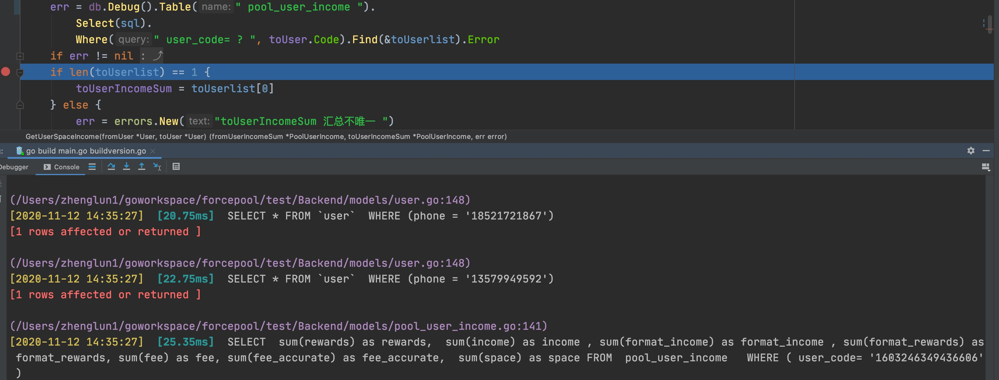
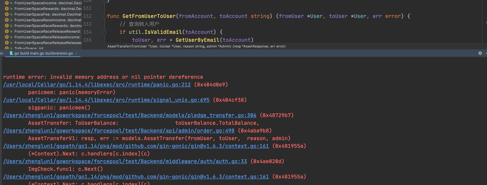

# 

问题原因：
收益数据由23:59:59改回到0点时， user端在修改的同时， 没有同步到admin端， 导致admin按23:59:59取数据， 而这个时间不再有数据， 所以显示可用余额显示为0 

今后措施： 
user端修改， 要同步修改到admin端

计算机， 不管多复杂， 本质上还是数字世界， 是对这个世界的模拟

#### 1

只有db.Debug() 时， 才会有 打印sql
(/Users/zhenglun1/goworkspace/forcepool/test/Backend/models/pool_user_income.go:141) 
[2020-11-12 14:35:27]  [25.35ms]  SELECT  sum(rewards) as rewards,  sum(income) as income , sum(format_income) as format_income , sum(format_rewards) as format_rewards, sum(fee) as fee, sum(fee_accurate) as fee_accurate,  sum(space) as space FROM  pool_user_income   WHERE ( user_code= '1603246349436606' )  

资产转移详情增加转出用户， 转入用户的三个表的转移前的历史记录数据，和转移后的数据。 三个表分别为矿池收益， spacerace奖励与释放， balance表

### 2

s