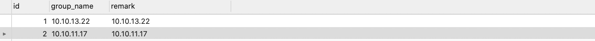
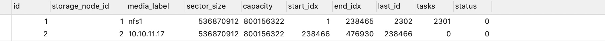
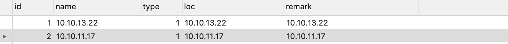
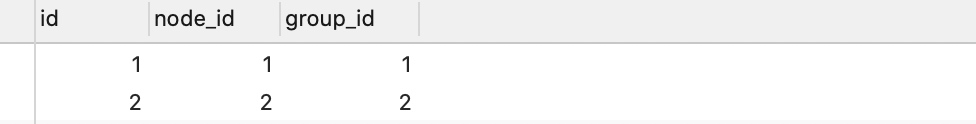
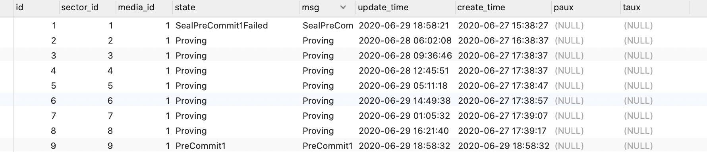
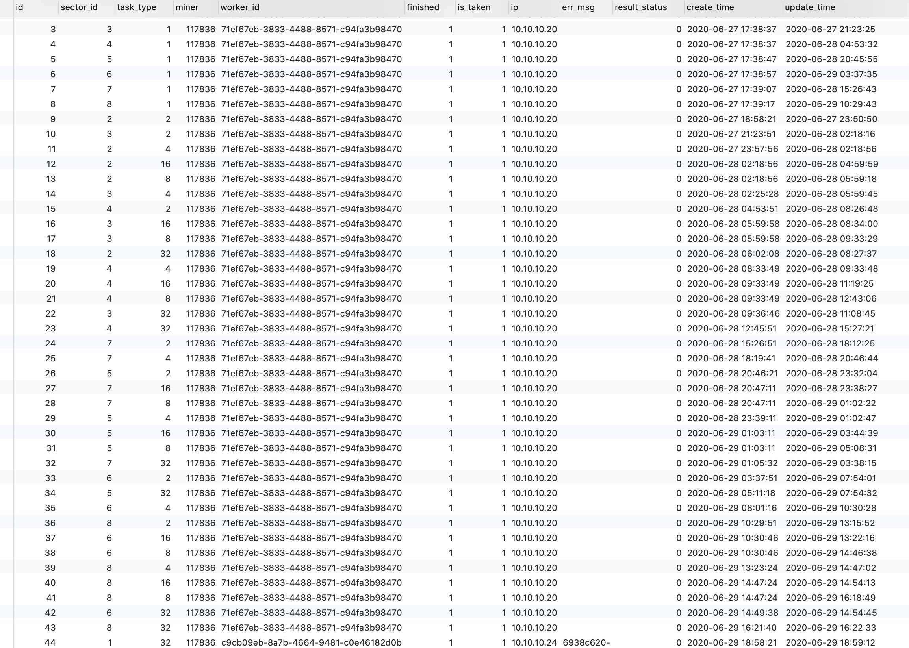

### 将一组机会加入到一个私链的方法。 

10.10.10.206
10.10.10.207
10.10.10.208
10.10.10.209
10.10.10.210
10.10.10.211
10.10.10.212
10.10.10.213
10.10.10.214
10.10.10.215
10.10.10.216
10.10.10.17

10.10.10.17起sealer,   P1 pc.  sealer命令group参数该为2， 

10.10.10.206
10.10.10.207
10.10.10.208
10.10.10.209
10.10.10.210
10.10.10.211 起p23  修改config.toml配置文件里的group

10.10.10.212
10.10.10.213
10.10.10.214
10.10.10.215
10.10.10.216  起p4  修改config.toml配置文件里的group

### 四个表中增加记录： 
groups:

media_infos:

storage_nodes:

storage-node-groups:

32G 耗时：

