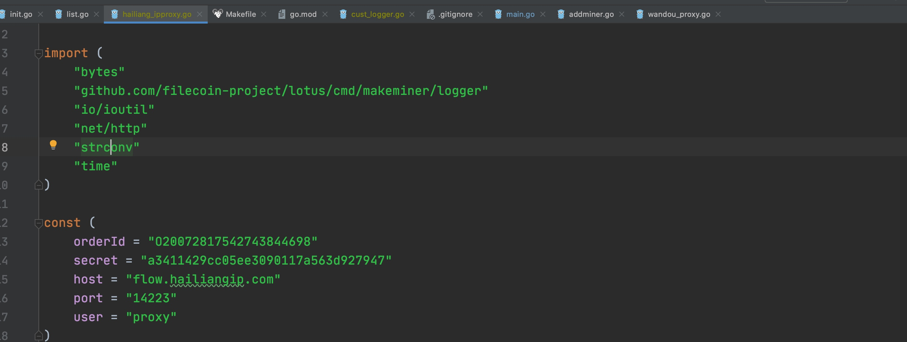
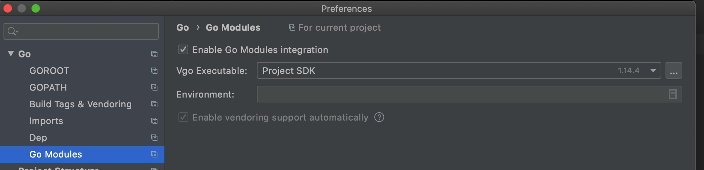
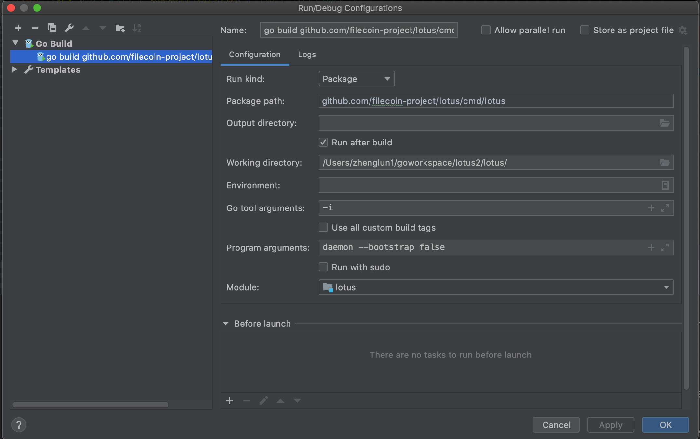
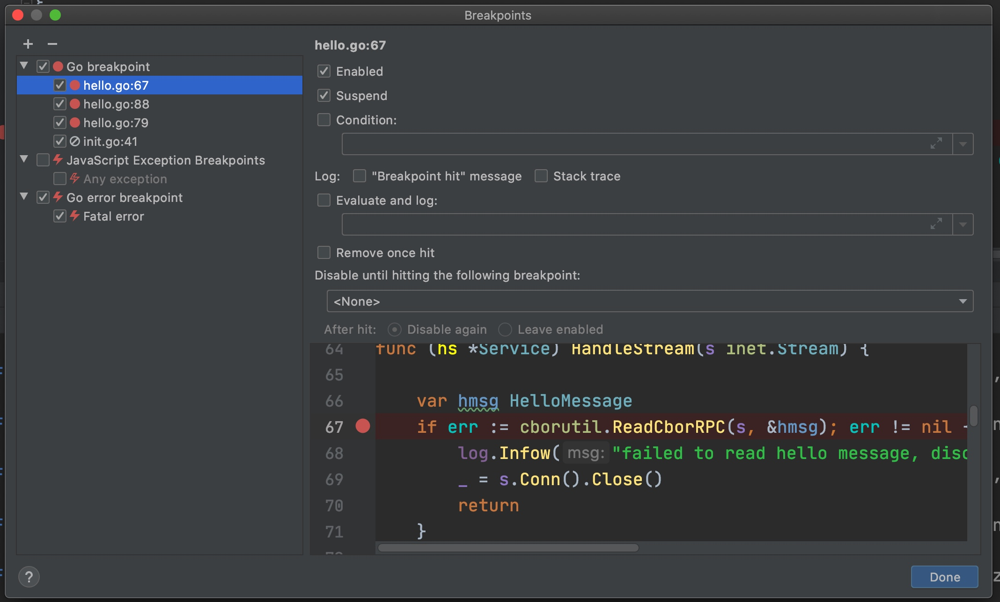
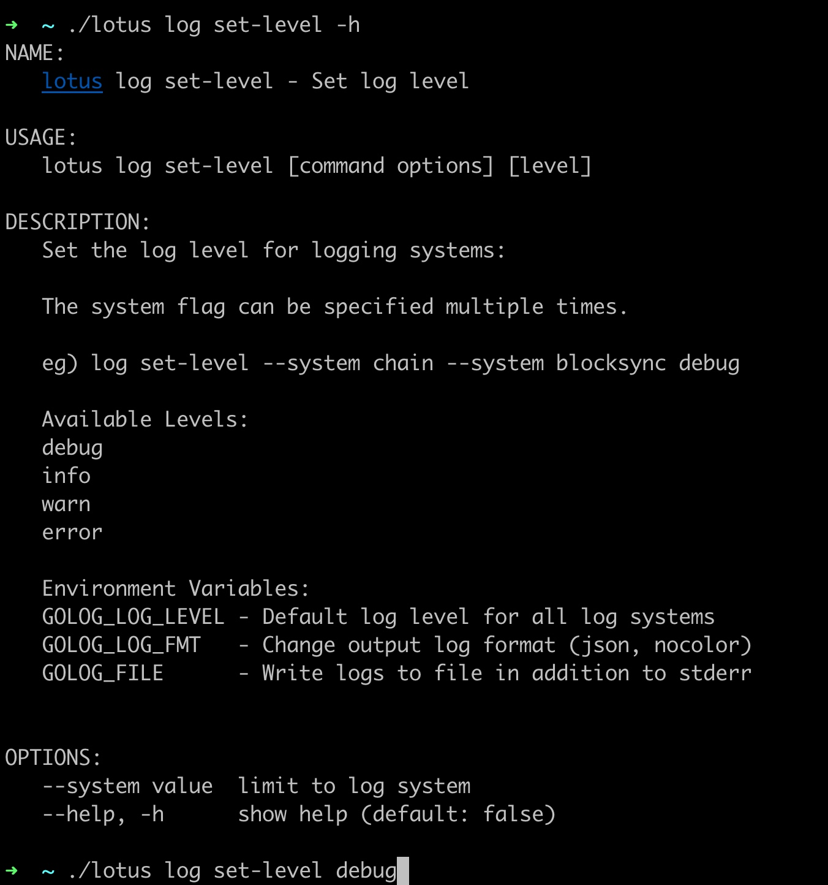
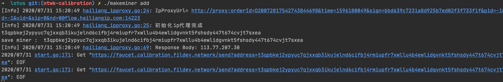
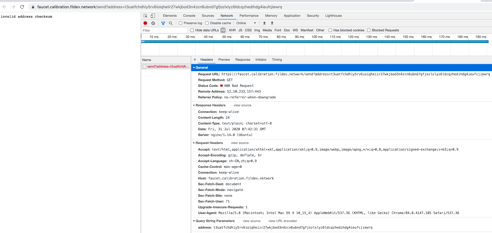
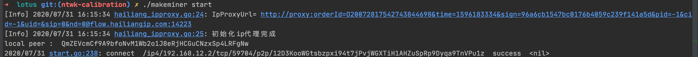
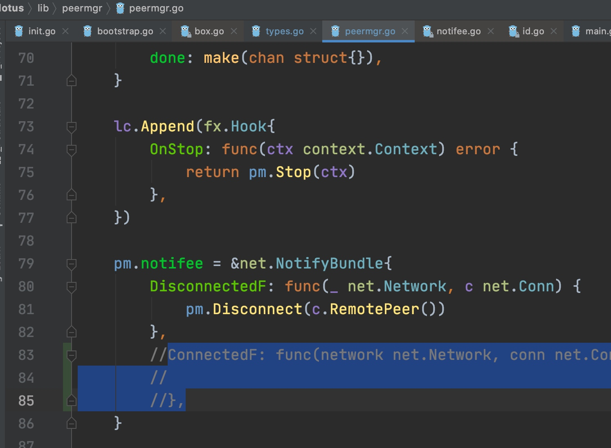

###  go.mod的module 确定了本地报名
go.mod 里的

module github.com/filecoin-project/lotus

确定了每个引入的包名：


### 调试

#### module 配置
Evnviroment保持为空



#### 不要go mod vendor
可以go mod init , go mod tidy, 但不要go mod vendor, 否则引起代码拷贝， 编译错误。 
不用go mod vendor, 第三方代码放到exeternal libraries里， 可以代码链接， 不会红色：


#### 配置编译 go build 


#### lotus不通主要断点位置



### rpc错误

lotus.log 里的rpc错误：

```
2020-07-31T13:56:23.320+0800    INFO    hello   hello/hello.go:179      time offset     {"offset": 0.000003, "peerid": "QmWNqm66Hj9eqYpBfaxiPWGb5oRr6Bowfof4sD7nyLBW2d"}


2020-07-31T14:21:55.924+0800    INFO    pubsub  go-libp2p-pubsub@v0.3.2/comm.go:51      error reading rpc from QmVSd1Xv2rPUzn59GV6Nz7qt8aQx1EUPViUFK5N6Foh2Ni: stream reset

```

### lotus.log 设置log等级




### stream reset
一次链接断了， 下次就不能用了


#### 申请钱申请不到



#### 没有钱导致消息发不出去
查看消息：
./lotus mpool pending
消息的nonce值

到其他节点看t3：
./lotus state get-actor t3uqjah7mo5wgtuq2qcgm2rowlk33yq3a5kwp5jqnqcwaf6ldz7dgjdjwkupkj24sxz73vk5yfpg5tub32qfna

#### 算力恢复
时间到了， 
昨天这个时间惩罚了， 然后把这些sector整好，或什么其他操作， 今天同一时间， 会重新证明， 所以算力会恢复， 所以只有在重新证明的时候， 才会恢复算力。 


#### 水龙头问题



#### lotus

最新分支有lotus运行中改变bootstrap blacklist和whitelist的命令，和net 差不多，保存在内存中，并不会记录在文件，重启后需要重新配置，命令参考： ./lotus peermgr -h，COMMANDS:
```
blacklist  Print peers blacklist
blremove   Remove peer from blacklist
bladd      Add peer to blacklist
whitelist  Print peers whitelist
wlremove   Remove peer from whitelist
wladd      Add peer to whitelist
reconn     Reconn peer
```
   
#### lotus 收到的消息的流程

makeminer 
一个Peer练到一个lotus节点时， lotus节点的流程：

1 basic_host.go 拨通连接QmTd6UvR47vUidRNZ1ZKXHrAFhqTJAD27rKL9XYghEKgKX
```
basichost       basic/basic_host.go:702 host 12D3KooWGtsbzpxi94t7jPvjWGXTiH1AHZuSpRp9Dyqa9TnVPu1z dialing QmTd6UvR47vUidRNZ1ZKXHrAFhqTJAD27rKL9XYghEKgKX

swarm2  go-libp2p-swarm@v0.2.7/swarm_dial.go:240        [12D3KooWGtsbzpxi94t7jPvjWGXTiH1AHZuSpRp9Dyqa9TnVPu1z] swarm dialing peer [QmTd6UvR47vUidRNZ1ZKXHrAFhqTJAD27rKL9XYghEKgKX]
```

2  连接建立
```
 network for 12D3KooWGtsbzpxi94t7jPvjWGXTiH1AHZuSpRp9Dyqa9TnVPu1z finished diali
```

3  身份消息收发
```
net/identify    identify/id.go:407      /ipfs/id/1.0.0 sent message to QmZEVcmCf9A9bfoNvM1Wb2o1J8eRjHCGuCNzxSp4LRFgNw /ip4/192.168.12.2/tcp/9000
net/identify    identify/id.go:424      /ipfs/id/1.0.0 received message from QmZEVcmCf9A9bfoNvM1Wb2o1J8eRjHCGuCNzxSp4LRFgNw /ip4/192.168.12.2/tcp/9000
net/identify    identify/id.go:618      12D3KooWGtsbzpxi94t7jPvjWGXTiH1AHZuSpRp9Dyqa9TnVPu1z received listen addrs for QmZEVcmCf9A9bfoNvM1Wb2o1J8eRjHCGuCNzxSp4LRFgNw: [/ip4/192.168.12.2/tcp/9000]
```

4 add peer
```
pubsub	go-libp2p-pubsub@v0.3.2/gossipsub.go:442	PEERUP: Add new peer QmZEVcmCf9A9bfoNvM1Wb2o1J8eRjHCGuCNzxSp4LRFgNw using /meshsub/1.1.0
swarm2	go-libp2p-swarm@v0.2.7/swarm.go:321	[12D3KooWGtsbzpxi94t7jPvjWGXTiH1AHZuSpRp9Dyqa9TnVPu1z] opening stream to peer [QmZEVcmCf9A9bfoNvM1Wb2o1J8eRjHCGuCNzxSp4LRFgNw]
dht	go-libp2p-kad-dht@v0.8.1/dht.go:607	peer stopped dht	{"peer": "QmZEVcmCf9A9bfoNvM1Wb2o1J8eRjHCGuCNzxSp4LRFgNw"}
```


5 给peer发送hello消息
```
hello	hello/hello.go:149	Sending hello message: [bafy2bzacedm25s7nmp4forvpbian3ik36uv4yik2fe7tqzgv6z6xystmi3i5q] 0 bafy2bzacedm25s7nmp4forvpbian3ik36uv4yik2fe7tqzgv6z6xystmi3i5q
543+0800	INFO	hello	hello/hello.go:179	time offset	{"offset": -0.0001955, "peerid": "QmZEVcmCf9A9bfoNvM1Wb2o1J8eRjHCGuCNzxSp4LRFgNw"}
```

6 genesis from hello
```
hello	hello/hello.go:74	genesis from hello	{"tipset": [{"/":"bafy2bzacedm25s7nmp4forvpbian3ik36uv4yik2fe7tqzgv6z6xystmi3i5q"}], "peer": "QmZEVcmCf9A9bfoNvM1Wb2o1J8eRjHCGuCNzxSp4LRFgNw", "hash": "bafy2bzacedm25s7nmp4forvpbian3ik36uv4yik2fe7tqzgv6z6xystmi3i5q"}
```

7 将消息从network加入到消息池
```
sub	sub/incoming.go:407	failed to add message from network to message pool (From: t3qpbkej2ypyuc7qjxxqb3ikujelnd6cifbj4rmiupfr7xwllu4b4ewlidgvnkt5fshsdy447t674cvjt7sxea, To: t04, Nonce: 1, Value: 0 FIL): failed to look up actor state nonce: get actor: resolution lookup failed (t3qpbkej2ypyuc7qjxxqb3ikujelnd6cifbj4rmiupfr7xwllu4b4ewlidgvnkt5fshsdy447t674cvjt7sxea): resolve address t3qpbkej2ypyuc7qjxxqb3ikujelnd6cifbj4rmiupfr7xwllu4b4ewlidgvnkt5fshsdy447t674cvjt7sxea: address not found: broadcasting message despite validation fail
```

以上的log的意思是：待验证消息的from在链上找不到， 所以这个消息验证失败，不能进入mpool。
    
```
pubsub	go-libp2p-pubsub@v0.3.2/validation.go:340	message validation punted; ignoring message from QmZEVcmCf9A9bfoNvM1Wb2o1J8eRjHCGuCNzxSp4LRFgNw
```

消息验证失败了， 忽略发这个消息的 peer： QmZEVcmCf9A9bfoNvM1Wb2o1J8eRjHCGuCNzxSp4LRFgNw发来的消息


#### peer 与lotus 空节点的连接
因为makeminer 这个peer的getNetName(), 得到的是公网的name， lotus空节点的name不是公网， 所以这个peer去连lotus时， 会有个短暂的连接， 随后，因为name错误原因， 又会断开：
因为官方代码， 没有连接成功的函数回调，

 所以官方版本没有这个peer与lotus连接成功的log. 
 