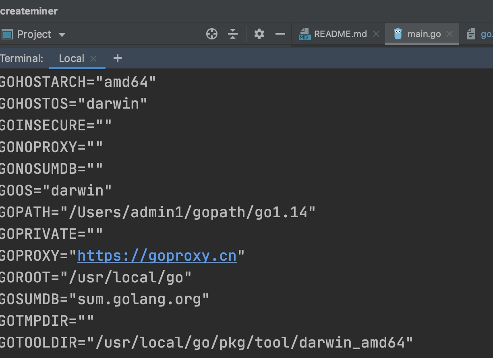

make 报出一些包没安装， 直接按提示安装缺少的包就行，如下两个地方注意 

### rust 安装


$ brew install rust
上面的方式安装后不能使用 rustup 工具来管理版本，所以不推荐。

如果想用 brew 安装，那就直接安装 rustup 工具：

$ brew install rustup-init
然后执行：

$ rustup-init
一律默认安装。 

可以安装好rustup等工具， 

然后command+n 弹出新窗口， 到lotus目录运行
```
make
```


### go proxy
make到最后遇到：
```
go: contrib.go.opencensus.io/exporter/jaeger@v0.1.0: Get "https://proxy.golang.org/contrib.go.opencensus.io/exporter/jaeger/@v/v0.1.0.mod": dial tcp 216.58.200.49:443: i/o timeout
make: *** [lotus] Error 1
```

解决办法：
```
➜  lotus git:(ntwk-calibration) cat ~/.bash_profile
export GOROOT="/usr/local/go"
export PATH=$PATH:/usr/local/go/bin:~/gopath/bin:/Users/admin1/bin/protobcuf/bin
export GO111MODULE="on"
export GOPATH="/Users/admin1/gopath/go1.14"
export GOPROXY="https://goproxy.cn"

export PATH="$HOME/.cargo/bin:$PATH"
➜  lotus git:(ntwk-calibration) source ~/.bash_profile
```


### 没有引入到外部库，导致没有建立索引


解决办法：


随后出现两个后台进程：


实用了on my zsh， 启动goland  就会用
```
  ~ cat .zprofile
export GOROOT="/usr/local/go"
export PATH=$PATH:/usr/local/go/bin:~/gopath/bin:/Users/admin1/bin/protobcuf/bin
export GO111MODULE="on"
export GOPATH="/Users/admin1/gopath/go1.14"
export GOPROXY="https://goproxy.cn"
export PATH="$HOME/.cargo/bin:$PATH"
➜  ~
```

从zsh里看到的是.zprofile配置好的：


有了外部库


代码就能建立索引了
