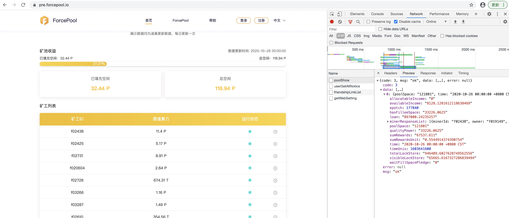

### 新部署地址

#### 分配12台服务器：
10.10.11.30
10.10.11.31
10.10.11.32
10.10.11.33
10.10.11.34
10.10.11.35
10.10.11.36
10.10.11.37
10.10.11.38
10.10.11.39
10.10.11.40
10.10.10.21

我目前使用的资源情况：
跳板机： root@103.78.229.68  端口54073
节点主机和在上面的运行程序
10.10.11.30   512M私有链创世节点
10.10.11.31  运行lotus, lotus-server, poster
10.10.11.32  运行sealer
10.10.11.33  运行P2 P3
10.10.11.34  运行P2 P3
10.10.11.35  运行P2 P3
10.10.11.36  运行P2 P3
10.10.11.37  运行P4
10.10.11.38  运行P4
10.10.11.39  运行P4
10.10.11.40  运行P4
10.10.10.21。 运行P1 PC

#### 部署
11.30节点 做私链创世节点
11.31节点跑 lotus，server， poster。 
11.32节点跑  sealer。
10.21节点是amd服务器， 上面跑pc和p1。 Pc包括p5和p6 
11.33 到 11.36节点 共四台， 跑P2 和P3
11.37 到 11.40节点 共四台， 跑P4。 

interop  落后于testnet ，      
集群算力增长情况，跑internet原因是支持512M ，  就跑一个私网，     
先512M， 再跑。 
官方的代码， 怎么分开， p1 跑私链。  官方的私链

#### 
如果P6删除， 发现要删除的文件不存在， 32任务就会报错， 状态为2

